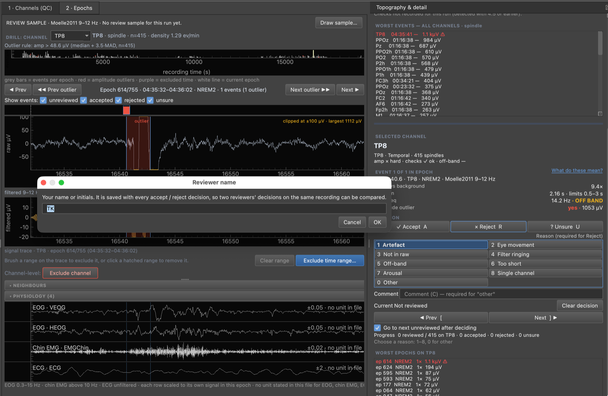
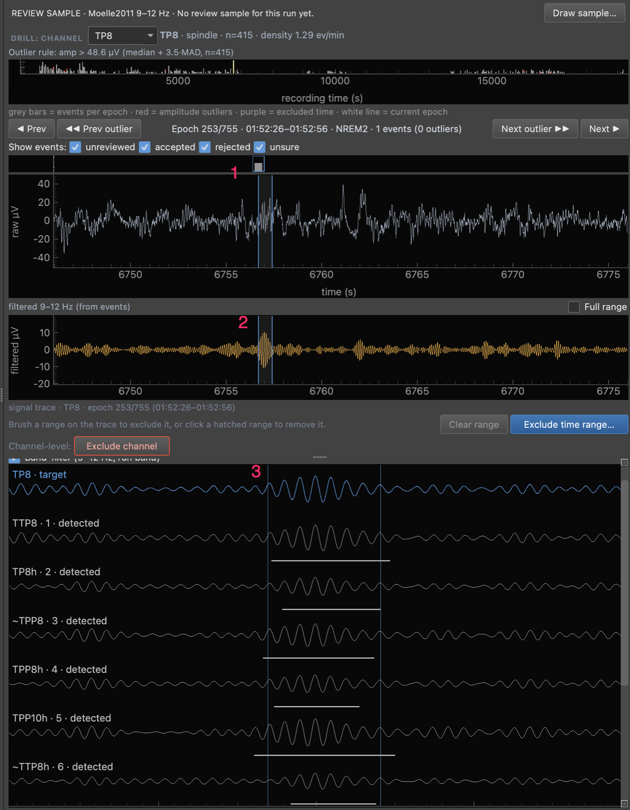
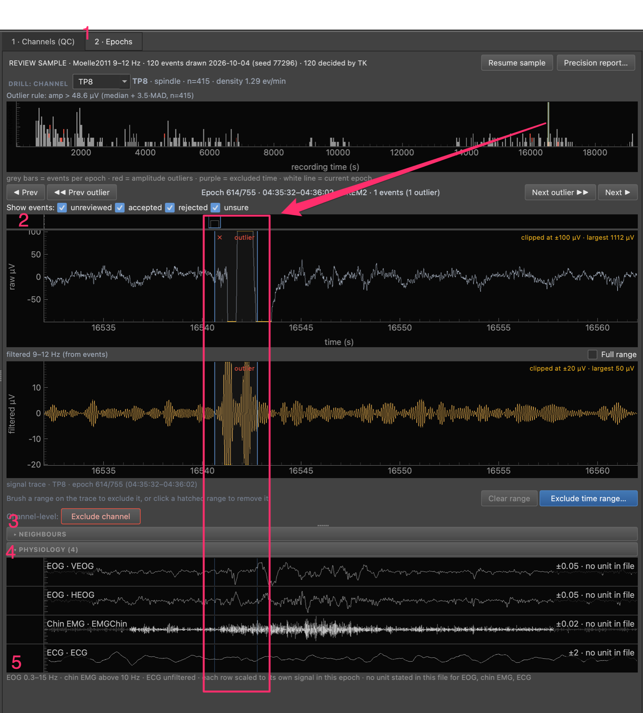

# How to Decide Whether a Detected Event Is Genuine

Use this when you have selected one event in the **Epochs** tab of the review
GUI and need to record accept, reject or unsure. You do not need a sleep
background. The detector looks for short bursts of brain activity (a sleep
spindle is a burst of regular waves, about 11 to 16 per second, lasting around
half a second to two seconds). Your job is to say whether the burst it found is
a real one, or something else that looks like one: noise, an eye movement, a
muscle twitch, or a different rhythm.

You apply the same six checks to every event, in the same order, so two
reviewers reach the same call for the same reasons. The Event panel gives four
numbers to help. They are aids, not rules: no number rejects an event on its
own. For the reasoning behind each, see
[Event figures and review sampling](../explanation/event-figures-and-review-sampling.md).

## Before you start

- Open the database, the EEG file and the annotation file (**File** menu), then
  click **Open in Epochs** on a channel in the Channels tab.
- Set your name with **Review ▸ Reviewer name…**. Nothing is saved without it.
- Select an event by clicking its band on the trace, or press `]` for the next
  event you have not decided.
- Read the Event panel in the right dock. Its link **What do these mean?** (also
  **Help ▸ What the event figures mean**) opens a short explanation that works
  without a network connection. Hover any row for the numbers behind it.

*The `Reviewer name` prompt, opened by the first decision of a session.*

The prompt asks for your name or initials (here `TK`) and has **Cancel** and
**OK**. Behind it, **Reject** is armed in the **DECISION** panel and the reason
grid is waiting, with `1 Artefact` outlined.

## What the Event panel shows

Under the header `EVENT i OF n IN EPOCH`, one line gives the time, the channel,
the sleep stage and the detector with its frequency band. Then four rows:

| Row | In plain words |
|---|---|
| `Signal vs background` | How many times bigger the burst is than the signal around it. About `1×` means it does not stand out. |
| `Duration` | How long it lasts, next to the shortest and longest the detector allows. |
| `Peak freq` | The rhythm that dominates the burst, and whether it is inside the band the detector searched (`in band`) or not (`OFF BAND`). Slow waves and K-complexes show `Wave freq` instead. |
| `Amplitude outlier` | Whether the burst is much larger than the other events on this channel. A very large one deserves a look at the raw trace. |

Hover for the detail: the number of waves that stand out, the cycle count, how
strong the frequency peak is, and how far above the detector's threshold the
burst went.

## The six checks

Work through them in order and stop at the first one that fails.

### 1. Look at the raw trace first

Look at the unfiltered trace before any number. If you cannot see a regular
oscillation in the raw signal, reject with **Not in raw**. If a sharp step or
spike sits under it, reject with **Filter ringing**: the filter that finds the
band turns a sudden jump into a short fake oscillation.

Where: the raw trace above the filtered trace. When one very large event
squashes the trace, it is drawn clipped at the edge with a note
`clipped at ±… µV`; tick **Full range** to see all of it.

### 2. Check how long it lasts and how many waves it has

A spindle should last at least half a second and show several clear waves. A
burst at the shortest length the detector allows only just qualified, so be
stricter with it.

Where: the `Duration` row, which says `at the shortest allowed` when that
applies; hover it for the number of waves that stand out from the background.

### 3. Check that it stands out from its surroundings

A genuine event is clearly larger than the seconds around it and rises and falls
smoothly. A `Signal vs background` value near `1×` means it does not stand out.

Where: the `Signal vs background` row and the filtered trace. The
`Amplitude outlier` row tells you if the event is far larger than usual on this
channel, which is worth checking in the raw trace.

### 4. Check the frequency and the site

The dominant rhythm should be inside the band. A rhythm of about 8 to 10 per
second on a channel at the back of the head is usually the resting alpha rhythm,
not a spindle. Reject it as **Off-band** unless the frontal channels show the
same burst.

Where: the `Peak freq` row and the `PPOz`-style channel name in the header line.
For an event under one second the value starts with `≈` because it is only
accurate to a coarse step; hover for the size of that step.

!!! warning "The band can itself be wrong for the site"
    `in band` is true for alpha when the run band includes alpha. The call then
    rests on the site, the neighbours and the EOG and EMG, not on the words.

### 5. Check whether neighbouring channels show it too

A genuine spindle usually appears on nearby channels at about the same time. One
channel only, with clean neighbours, is suspect but not proof.

Where: the **Neighbours** group under the filtered trace. The target is on top
(`E75 · target`) and up to six nearest channels follow, labelled by rank
(`E19 · 1` is the nearest). Two blue lines mark the selected event on every row,
and a short bar under a neighbour's trace marks an event the detector found on
that channel. All rows share one scale, given in the legend.

*A spindle on TP8 with the Neighbours group open.*

1. The raw trace. The two thin blue lines mark the start and end of the
   selected event.
2. The filtered 9–12 Hz trace for the same window.
3. The **Neighbours** group: `TP8 · target` on top, then the nearest channels
   labelled by rank (`TTP8 · 1 · detected`, `TP8h · 2 · detected`, and so on).
   A `~` before a name (`~TPP8`) marks an interpolated channel, and the bar under
   a trace marks the event detected on that channel.

### 6. Check the eye and muscle channels

A rise in chin muscle activity, or eye movements, during the burst means an
arousal or an eye artefact.

Where: the **Physiology** group under Neighbours. Two thin lines on each row
mark the start and end of the event. Each row is scaled to its own signal in this
epoch, and the label at its right gives the size of that scale; where the file
states no unit the label says `no unit in file`, so compare the shape and timing,
not the numbers.

*The Physiology group for an outlier event on TP8.*

1. The **2 · Epochs** tab.
2. The pink box and arrow (added to the screenshot) show that the selected
   event sits at the same moment on every row: the raw trace, the filtered
   trace and the physiology rows. The arrow runs from the current epoch on the
   overview strip.
3. **Channel-level: Exclude channel**.
4. The **PHYSIOLOGY (4)** group header, below the collapsed **NEIGHBOURS**
   header.
5. The four rows: `EOG · VEOG`, `EOG · HEOG`, `Chin EMG · EMGChin` and
   `ECG · ECG`. The label at the right of each row gives its scale (for example
   `±0.05 · no unit in file`), and the line under them lists the filters used.

## Record the decision

1. Press `A` to accept when all six agree.
2. Press `R` to reject, then a digit for the first reason that failed (table
   below), or click a reason button. `Enter` repeats the last reject reason of
   the session.
3. Press `U` to mark unsure when the checks conflict. A reason is optional.
4. Press `C` to type a comment, and `Enter` to save it. Reason `0` (Other) needs
   a comment.
5. Press `Ctrl+Z` (`Cmd+Z` on macOS) to undo the last decision.

Only a saved decision looks selected on the three buttons; while a reject or
unsure waits for a reason its button shows a border only. To come back to events
you rejected or were unsure about, see
[Recheck your rejected and unsure events](review-eeg-events.md#recheck-your-rejected-and-unsure-events).

Nothing is written for a reject until you choose a reason. You can also click a
reason button with nothing armed: that arms Reject with that reason
preselected, and the hint reads `Click {label} again or press Enter to reject
({label})`. A second click on the same reason, or `Enter`, writes the reject. A
click on a different reason switches the preselection. `Esc`, selecting another
event or paging cancels it. A digit with nothing armed does nothing, so a stray
key never writes. Press `?`
to see the keys and the reason grid for the event type you are on.

!!! note "While you review a sample, the reading words are hidden"
    In live sample review the Event panel keeps the numbers but hides words such
    as `in band`, `OFF BAND`, `at the shortest allowed` and the `yes` or `no` of
    the outlier row until you accept or reject the event. The outlier mark on the
    trace is not drawn for an undecided sample event either. Judge from the
    numbers and the traces.

## Reason codes and their RA categories

The grid depends on the event type. `0` is always Other.

| Key (spindles) | Key (slow waves, K-complexes) | Reason code | Meaning | Category when rejected |
|---|---|---|---|---|
| `1` | `1` | `artefact` | movement, electrode or muscle | FP-artifact |
| `2` | `2` | `eye-movement` | the deflection follows the EOG | FP-artifact |
| `3` | `3` | `not-in-raw` | not visible in the raw trace | FP-other |
| `4` | | `filter-ringing` | step or spike in the raw trace | FP-other |
| `5` | | `off-band` | outside the frequency band | FP-other |
| `6` | `4` | `too-short` | too short for the event type | FP-other |
| `7` | `5` | `arousal` | EEG speed-up, often with EMG | FP-other |
| `8` | `6` | `single-channel` | only on this channel | FP-other |
| | `7` | `not-isolated` | not isolated from other waves | FP-other |
| | `8` | `wrong-morphology` | wrong shape for the event type | FP-other |
| `0` | `0` | `other` | described in the comment | FP-other |

Each decision maps to one of four categories of the research-assistant (RA)
protocol. `turtlewave_hdEEG.dbwrite.review_category(decision, reason)` returns
the category. Accept is TP (true positive), unsure is Ambiguous, and a reject
with no reason is FP-other. Posterior alpha without an arousal is `off-band`,
not `arousal`. A stored reason with no button in the current grid still shows
on the `Current` line.

## Decisions are evidence, not deletions

A reject is stored in the `event_reviews` table, keyed by the event's uuid and
your name. It does not remove or alter the event in `events`. Density, CSV
exports and every other reader count the event as before unless you ask them to
leave rejected events out (`exclude_rejected=True`, off by default; see
[Validate a detection run](validate-a-detection-run.md#leave-rejected-events-out-of-density-or-an-export)).

Two consequences follow:

- Rejected events are the raw material of the precision estimate. Removing them
  would bias it.
- A reviewer who changes their mind overwrites only their own row. Other
  reviewers' decisions on the same event stay.

To leave a stretch of *time* out of the analysis for every channel, brush it on
the trace and use **Exclude time range…**; it takes effect when you export a
re-run package and re-detect with it. Rejecting with reason `artefact` labels that one event only.

## See also

- [Validate a detection run](validate-a-detection-run.md)
- [Event figures and review sampling](../explanation/event-figures-and-review-sampling.md)
- [Reference: EEG Review GUI](../reference/eeg-review-gui.md)
