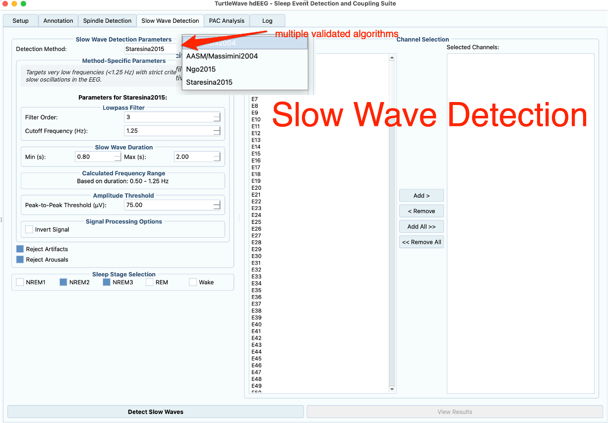

# How to Detect Slow Waves

This guide shows you how to detect slow waves in your sleep EEG data using TurtleWave.

## Prerequisites

Before detecting slow waves, ensure you have:

- Loaded your EEG data file
- Generated sleep annotations
- Set an output directory

If you haven't done these steps, refer to the [Getting Started tutorial](../tutorials/getting-started.md).

## Using the GUI

### Basic Detection

To detect slow waves with default parameters:

1. Open the **Slow Wave Detection** tab
2. Click **"Detect Slow Waves"**
3. Wait for processing to complete


*Slow Wave Detection tab showing available parameters and channel selection*

Results are written as one JSON file per channel to your output directory,
then aggregated into a parameters CSV, a density CSV, and imported into
`neural_events.db`.

### Adjusting Detection Parameters

To customize slow wave detection for your specific needs:

**Frequency Range:**

1. Locate the **"Frequency Range (Hz)"** controls
2. Set the low frequency (default: 0.1 Hz)
3. Set the high frequency (default: 4 Hz)

Typical slow wave frequencies are 0.5-4 Hz, but you may adjust based on your research requirements.

**Trough Duration:**

1. Find the **"Trough Duration (Negative Half-Wave)"** group
2. Set the minimum and maximum trough duration in seconds (default: 0.3-1.5 s)

**Amplitude Thresholds:**

1. Locate the **"Amplitude Thresholds"** group
2. Set the negative peak threshold in µV (default: -80 µV)
3. Set the peak-to-peak threshold in µV (default: 140 µV)

More negative/higher values make detection more stringent.

**Channel Selection:**

Select the channels of interest before running detection. If no channels are
selected, all channels will be processed.

### Running Detection

After configuring parameters:

1. Click **"Detect Slow Waves"**
2. Monitor progress in the status panel
3. Review detection statistics when complete

## Using the Python API

For programmatic access or batch processing, mirror
[`examples/hdEEG_sw_detector.py`](https://github.com/TancyKao/TurtleWave-hdEEG/blob/master/examples/hdEEG_sw_detector.py):

```python
from wonambi.dataset import Dataset as WonambiDataset
from turtlewave_hdEEG import ParalSWA, CustomAnnotations

# Load dataset and annotations
data = WonambiDataset('subject001.set')
annot = CustomAnnotations('subject001_annotations.xml')

# Create the processor
event_processor = ParalSWA(dataset=data, annotations=annot)

# Run detection
slow_waves = event_processor.detect_slow_waves(
    method='Massimini2004',
    chan=['E110', 'E111', 'E112'],
    frequency=(0.5, 1.25),
    trough_duration=(0.3, 1.5),
    neg_peak_thresh=-75.0,
    p2p_thresh=75.0,
    stage=['NREM2', 'NREM3'],
    reject_artifacts=True,
    reject_arousals=True,
    json_dir='wonambi/sw_results',
)
```

`method` also accepts `'AASM/Massimini2004'`, `'Ngo2015'`, or `'Staresina2015'`.
`polar='opposite'` is available for inverted-reference recordings.

## Interpreting Results

Detection writes one JSON file per channel to `json_dir`. Aggregate them into
CSV, then import into the database:

```python
freq_range = "0.5-1.25Hz"
stages_str = "NREM2NREM3"
file_pattern = f"slowwaves_Massimini2004_{freq_range}_{stages_str}"

event_processor.export_slow_wave_parameters_to_csv(
    json_input='wonambi/sw_results',
    csv_file='wonambi/sw_results/sw_parameters.csv',
    file_pattern=file_pattern,
)

event_processor.export_slow_wave_density_to_csv(
    json_input='wonambi/sw_results',
    csv_file='wonambi/sw_results/sw_density.csv',
    stage=['NREM2', 'NREM3'],
    file_pattern=file_pattern,
)

event_processor.import_parameters_csv_to_database(
    csv_file='wonambi/sw_results/sw_parameters.csv',
    db_path='wonambi/neural_events.db',
    method='Massimini2004',
)
```

The parameters CSV includes start/end time, channel, sleep stage, amplitude,
and frequency for each slow wave. Load it with pandas for statistical
analysis, or query `neural_events.db` directly once imported.

Alternatively, pass `write_db=True` and `db_path=...` to `detect_slow_waves`
to skip the JSON→CSV→import round-trip and write events straight into the
database — see
[Write Detection Results Directly to the Database](direct-to-database-detection.md).

## Optimizing Detection

### For High Sensitivity

If you want to detect more slow waves (higher sensitivity):

- Lower `neg_peak_thresh` / `p2p_thresh` (e.g. -60 / 70 µV)
- Widen the frequency range slightly
- Reduce the minimum trough duration

### For High Specificity

If you want only clear, unambiguous slow waves:

- Raise `neg_peak_thresh` / `p2p_thresh` (e.g. -90 / 150 µV)
- Narrow the frequency range
- Increase the minimum trough duration

### For Specific Sleep Stages

Pass the stages you want directly to `stage`:

```python
slow_waves = event_processor.detect_slow_waves(
    method='Massimini2004',
    chan=test_channels,
    stage=['NREM2', 'NREM3'],  # Only NREM stages 2 and 3
)
```

## Common Issues

### No Slow Waves Detected

If detection produces no results:

- **Check annotations**: Ensure sleep staging completed successfully
- **Verify data quality**: Check for excessive artifacts
- **Adjust thresholds**: Try relaxing `neg_peak_thresh` / `p2p_thresh`
- **Check frequency range**: Ensure it matches your data characteristics

### Too Many False Positives

If you're getting many artifacts detected as slow waves:

- **Raise thresholds**: Increase `neg_peak_thresh` / `p2p_thresh`
- **Improve preprocessing**: Run artifact detection first
- **Narrow frequency range**: Use more restrictive frequency bounds
- **Check specific channels**: Some channels may be noisier

### Performance Issues

If detection is slow:

- **Reduce channel count**: Process only channels of interest
- **Use batch processing**: Process multiple files overnight
- **Check system resources**: Ensure adequate RAM available

## Batch Processing Multiple Files

To process multiple files efficiently, loop over subjects and reuse the same
`ParalSWA` call shape:

```python
import os
from wonambi.dataset import Dataset as WonambiDataset
from turtlewave_hdEEG import ParalSWA, CustomAnnotations

subjects = ['sub-001', 'sub-002', 'sub-003']

for subject in subjects:
    root_dir = f'data/{subject}/'
    data = WonambiDataset(os.path.join(root_dir, f'{subject}_eeg.set'))
    annot = CustomAnnotations(os.path.join(root_dir, 'wonambi', f'{subject}_annotations.xml'))

    event_processor = ParalSWA(dataset=data, annotations=annot)
    slow_waves = event_processor.detect_slow_waves(
        method='Massimini2004',
        chan=['E110', 'E111', 'E112'],
        frequency=(0.5, 1.25),
        stage=['NREM2', 'NREM3'],
        json_dir=os.path.join(root_dir, 'wonambi', 'sw_results'),
    )
    print(f"{subject}: detected slow waves on {len(slow_waves)} channels")
```

For HPC batch runs across many subjects, see `examples/NCI_commands/` and the
`*_GADI.py` driver scripts referenced in the project README.

## Next Steps

After detecting slow waves, you might want to:

- Run spindle detection for comparison — [`examples/hdEEG_spindle_detector.py`](https://github.com/TancyKao/TurtleWave-hdEEG/blob/master/examples/hdEEG_spindle_detector.py)
- Review detected events in the QC dashboard — [Review EEG Events](review-eeg-events.md)
- Write results directly to the database — [Direct-to-Database Detection](direct-to-database-detection.md)
