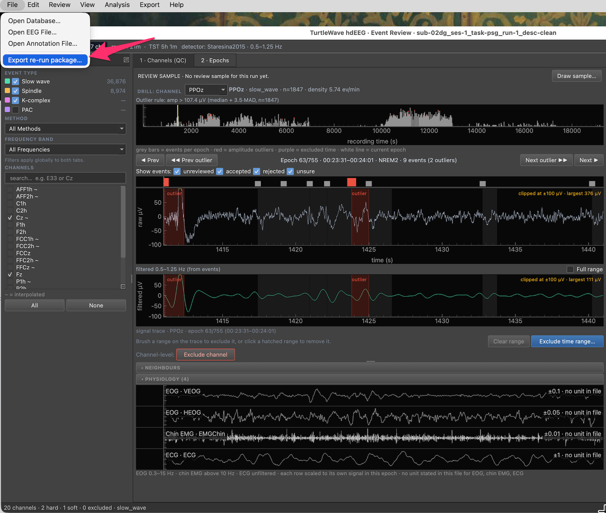

# Re-run Detection on Reviewer-Selected Channels

This guide walks through re-running a detector on only the channels a
reviewer flagged as needing another pass in the review GUI, with the
reviewer's marked artefact epochs excluded — without touching any other
channel's rows in `neural_events.db`.

!!! warning
    This is a **scoped** re-detection, not a whole-montage re-run. Only the
    channels you hand it are replaced; every other channel is left untouched.

## Step 1 — Export the re-run package from the review GUI

A time range you exclude in the Epochs tab does not change events already
detected. It takes effect through this package.


*A saved exclusion (hatched, `excluded`) and its row under **EXCLUDED TIME**.*

The status line at the bottom of the screenshot says the exclusion takes effect
when you export a re-run package (**File ▸ Export re-run package…**) and
re-detect with it.

In `eeg_review_gui`, choose **File ▸ Export re-run package…**.



*The File menu in the Epochs tab of a slow-wave run (PPOz, epoch 63/755, NREM2).*

The arrow points to **File ▸ Export re-run package…**, the last entry in the File menu.

The export:

1. Snapshots the current `wonambi/*_results` directories, `*.csv` files and
   the database into `<root>/qc_backup/<timestamp>/` — your rollback point.
2. Writes `rerun_sidecar.xml`: a copy of the base annotation XML with **every
   current time exclusion** the reviewer saved with **Exclude time range…**
   appended as `Artefact` events, under the **same rater the detector will
   read** (never the original annotation file). Each package is complete: a range
   exported in an earlier package is included again, and a range the reviewer has
   since removed is left out. The `<stem>_review-qc.xml` file beside the
   annotation file is only a record of the review; detection never reads it, so
   exclusions reach detection only through this package.
3. Writes `channels.csv` — the kept channels (whole montage minus any
   excluded channel).
4. Writes `redetect_channels.csv` — **only** the channels the reviewer
   explicitly queued for re-detection (skipped entirely if none were queued).

The dialog ends with a suggested `examples/rerun_detection.py` command with this
recording's files (`--annot rerun_sidecar.xml`, `--eeg`, `--db`, `--event-type`,
`--method`, `--freq`, `--stages`). With channels queued it says "Re-detects the
queued channels only:" and passes `--channels redetect_channels.csv`. With
nothing queued it says "Nothing is queued, so every kept channel (channels.csv)
is re-detected:" and passes `--channels channels.csv`; excluded channels are not
touched and keep their old rows. For PAC there is no command-line re-run; re-run
it from `turtlewave_gui` with `rerun_sidecar.xml`.

!!! warning
    A whole-montage re-run replaces every kept channel's events. Sample
    decisions on events whose end time moves become void. The snapshot is the
    rollback.
 Take note of the backup
directory path; you'll pass files from it below.

## Step 2 — Run the re-run driver

```bash
python examples/rerun_detection.py \
    --annot   /path/qc_backup/<timestamp>/rerun_sidecar.xml \
    --eeg     /path/sub-XXX_eeg.set \
    --db      /path/wonambi/neural_events.db \
    --channels /path/qc_backup/<timestamp>/redetect_channels.csv \
    --event-type spindle --method Wamsley2012 \
    --freq 11 16 --stages NREM2 NREM3 --cat 1 1 1 0
```

`--ref-chan` and `--polar` are optional — when omitted they're recovered from
the original run's `detection_runs` provenance row (see
[Direct-to-database detection](direct-to-database-detection.md)).

!!! warning "`--cat` is required for databases predating this feature"
    `cat` (the fetch concatenation tuple) is only recorded in provenance for
    databases written by this re-run/direct-write generation (P3+). A
    database written before that never recorded it, so `--cat` must be passed
    explicitly for those — the driver refuses to guess. Production runs
    concatenate with `cat=(1, 1, 1, 0)`; a silently-assumed different value
    pools the signal differently and shifts every threshold.

## What the driver does, in order

1. Loads the sidecar annotation and the EEG file.
2. **Rater-match guard** (`verify_rater_match`): confirms the rater the
   detector will actually read carries both the sleep staging AND every
   artefact/arousal event in the file. If the sidecar's artefacts ended up
   under a different rater than the staging, the detector would reject
   *nothing* and silently produce a still-contaminated re-run — this guard
   fails loudly instead.
3. **Parameter-invariance guard** (`resolve_rerun_params`): resolves
   `ref_chan` / `polar` / `cat`, preferring explicit CLI overrides, else the
   original run's recorded provenance. A wrong `polar` inverts trough
   polarity and a different `ref_chan` makes amplitude thresholds
   incomparable, so this refuses outright if neither source has a value.
4. **Clean-time gate** (`channel_clean_gate`), applied whole-montage
   (channel-global, all-or-nothing — see the note below): channels are
   FORCED-DROP rather than re-detected if there's less than `--n-min-min`
   minutes (default 5) of artefact-free in-stage time, or more than
   `--max-excluded-frac` (default 0.5) of in-stage time is excluded as
   artefact.
5. Re-detects the surviving channels with `write_db=True,
   replace_channels=<survivors>`. Artefact epochs are excluded at
   **estimation time** — the detector's `fetch` call excises them before
   threshold pooling — not by detecting first and deleting events after.
   Each surviving channel's stale rows for this exact scope are
   DELETE-then-INSERT replaced in one transaction, so a cleaner re-run that
   yields *fewer* events doesn't leave surplus stale rows behind.
6. Records a `rerun_log` provenance row: which channels were selected,
   actually re-detected, or forced-dropped, plus the sidecar and
   `qc_backup` snapshot paths — so the re-run is self-describing and its
   rollback point is always on record.

Export/import CSV steps are intentionally skipped; the database is the
source of truth after a re-run.

!!! note "The clean-time gate is whole-montage, not per-channel"
    The current review-GUI sidecar marks artefacts channel-globally
    (`chan='(all)'`), and Wonambi's artefact-subtraction only matches
    channel-global or exact-channel marks faithfully. So the gate evaluates
    once for the whole re-run: either every selected channel is re-detected,
    or every one is forced-dropped. A true per-channel gate needs
    per-channel artefact marking and a per-channel `fetch`, tracked as a
    follow-up.

## Roll back a re-run

If a re-run needs to be undone, restore the snapshotted files from
`qc_backup/<timestamp>/` (the `wonambi/*_results` directories, any `.csv`
files, and the database copy) over the current ones. The `rerun_log` table
records the exact `backup_path` used for each re-run.

## Troubleshooting

### Export re-run package is greyed out

**Export re-run package…**, **Exclude time range…** and the `n queued` link are
disabled when the loaded annotation file does not belong to the open database.
The tooltip reads `Load the annotation file for {subject} first (File ▸ Open
Annotation File…).` The package is built from that annotation file, so the GUI
will not export from another recording's.

1. Read the status bar. After you open a file it may say
   `Annotation file unloaded: it belongs to {stem}. Load the annotation for {subject}.`
2. Choose **File ▸ Open Annotation File…** and open the annotation for the
   subject named in the tooltip.
3. If the file is the right one but is still unloaded, its name and the two
   folders above it do not contain the subject. This happens with a generically
   named file (for example `annotations.xml`) three or more folders below the
   subject folder. Rename the file to include the subject, such as
   `sub-01_annotations.xml`, and open it again.

If the status bar says `Cannot check that {stem} belongs to this database (no
subject recorded). Check it is the right recording.`, the file stays loaded and
the controls stay enabled. Confirm yourself that it is the right recording.

## See also

- [Direct-to-database detection](direct-to-database-detection.md)
- [Reference: rerun module](../reference/api/rerun.md)
- [Reference: dbwrite module](../reference/api/dbwrite.md)
