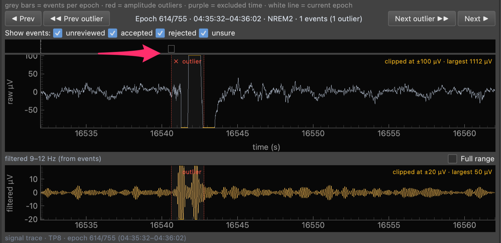
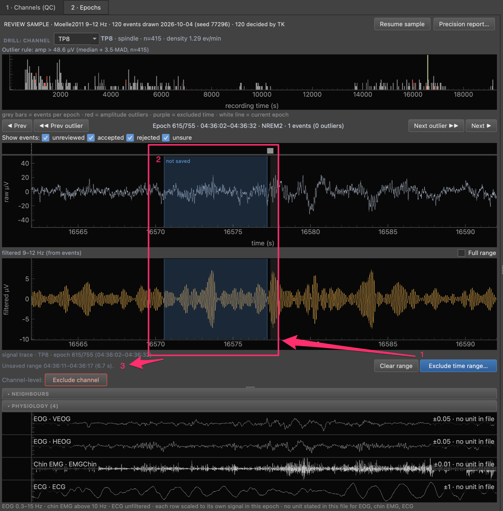
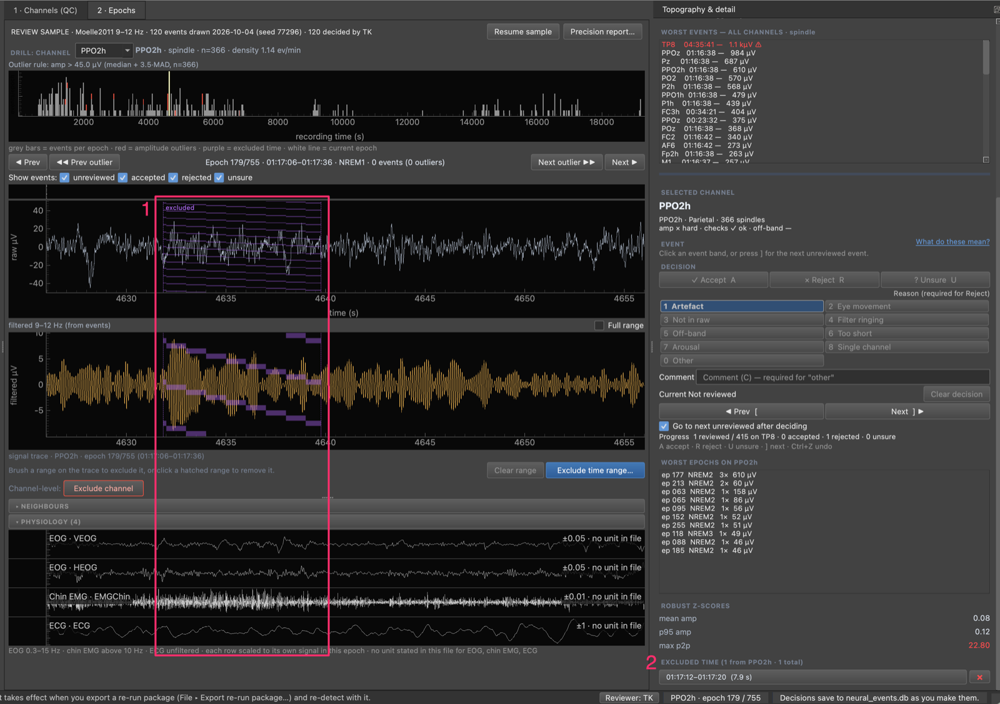

# How-to Guide: Review EEG Events

This guide provides practical solutions for specific QC-triage tasks in the TurtleWave EEG Review GUI. It assumes you've already loaded a database, EEG file, and (optionally) annotations — see the [tutorial](../tutorials/eeg-review-gui-tutorial.md) if you haven't.

## Prerequisites

The review GUI reads events out of `neural_events.db` — it doesn't detect
anything itself. Before you can review, events must already be detected into
that database. By default they already are — detection writes straight into
`neural_events.db`:

- [Detect Spindles](detect-spindles.md) (or slow waves / K-complexes /
  PAC — any detector works)
- If you ran detection with `write_db=False` / `--legacy-json`, follow the
  legacy JSON → CSV → `import_parameters_csv_to_database` route documented on
  each detector's how-to page, or see
  [Write Detection Results Directly to the Database](direct-to-database-detection.md#opt-out-the-legacy-json-csv-import-path)

## Triage Channels by QC Verdict

**Problem:** You want to see only the channels flagged as outliers before reviewing the rest.

**Solution:**

1. On the **1 · Channels (QC)** tab, open the **Show** combo and choose `Amp flagged`, `Excluded`, `Queued for re-detect` or `Dead`, or leave it on `All channels`
2. Open the **Sort** combo to order the rows, for example `Amp flag (hard first)`, `Amp z ↓` or `Density ↓`. Clicking a column header also sorts
3. Use the **Stage** buttons to set the stages used by the channel checks (the flagged-channel list and the check metrics on the topography)

!!! tip
    The count line above the table (`8 checks flagged · 3 amp flagged · 1 dead`) always counts all channels, whatever Show is set to. Click the `8 checks flagged` part to jump to the flagged-channel list in the right dock. Hover the `Amp flag` header for the rule.

## Find a Channel That Picks Up the Wrong Thing

**Problem:** You suspect a region detects alpha or noise as events.

**Solution:** On the Channels (QC) tab, switch the topography combo to
`Off-band share` (then `At-floor share`, `Amp vs background`, `Amp vs
threshold`). Read the flagged-channel list under the topography (or click `n
checks flagged` above the table): it states numbers, and you decide what they
mean. Low prominence is context only and never flags. The table itself has eight
columns, amplitude only. See
[Validate a detection run](validate-a-detection-run.md#run-the-population-checks-on-the-channels-tab).

For runs detected with 4.5 or earlier the check metrics are not recorded.

## Select an Event and Record a Decision

**Problem:** You want to say whether one event is genuine.

**Solution:**

1. Set **Review ▸ Reviewer name…**.
2. On the **2 · Epochs** tab, click an event band, or press `]` for the next
   undecided event on the channel.
3. Press `A` to accept, `R` and a digit `1`–`8` or `0` to reject with a reason, or `U`
   to mark unsure. `Ctrl+Z` undoes.

[Decide whether an event is genuine](decide-if-an-event-is-genuine.md) gives the
six checks to apply and the reason codes. A decision never removes the event.

*The same event after it was rejected.*

The arrow points to the event's marker in the strip above the raw trace, now an
outlined square. On the trace the event band carries a `✕` and a dashed red edge.

## Show Only Some of a Channel's Events

**Problem:** You want to see, among a channel's events, only those you decided a
certain way, or only those still undecided.

**Solution:** In the **Show events:** row above the raw trace, untick the boxes
you do not want: `unreviewed`, `accepted`, `rejected`, `unsure`. Events that do
not pass are drawn faint and skipped by `}` and `{`; clicking still selects them.
A chip reads `Showing: rejected · 3 of 1,847 on PPOz ✕`, ticks under the epoch
strip mark the epochs that hold shown events, and **◀ previous shown** and
**next shown ▶** step through them. The filter uses your own decisions only,
applies to the Epochs tab, and resets at every launch. Click **✕** on the chip to
show everything again.

## Recheck Your Rejected and Unsure Events

**Problem:** You want to look again at the events you rejected or were unsure
about, for example before you finish a channel.

**Solution:**

1. Drill into the channel (**Open in Epochs**).
2. In **Show events:**, tick only `rejected` and `unsure`.
3. Press **next shown ▶** (or `}`) to go to the first one. Look at the raw trace,
   the Event panel and the neighbours again.
4. To change your mind, press `A`, or `R` and a reason, or `U`. The decision is
   replaced and the event stays in view.
5. Press **next shown ▶** to move on. Click **✕** on the chip when you are done.

`Ctrl+Z` undoes the last change. Your decisions are saved as you make them.

## Look Up a Key

**Problem:** You forgot a key or the reason numbers.

**Solution:** Press `?` on either tab, or choose **Help ▸ Keyboard shortcuts…**.
The sheet lists the keys and the reason grid for the event type you are on. The
top bar also shows the main keys for the current tab.

## Filter by Event Type, Method, or Frequency Band

**Problem:** You need to focus on one detector's output at a time.

**Solution:**

1. In the left **Filters** dock, check only the event type(s) you want (Slow wave, Spindle, K-complex, PAC)
2. Use the **Method** dropdown to narrow to a single detection method
3. Use the **Frequency Band** dropdown to narrow to a single band

These filters apply globally, across both the Channels (QC) and Epochs tabs.

## Adjust Outlier Sensitivity

**Problem:** The default outlier thresholds are flagging too many, or too few, channels.

**Solution:**

1. **View → Outlier threshold…**
2. Adjust `hard |z| >`, `soft |z| >`, and the dead-channel fraction
3. Click **OK** — the QC dashboard recomputes immediately

## Restrict to Specific Channels

**Problem:** You only care about a subset of channels (e.g. frontal).

**Solution:**

1. In the left **Filters** dock, type into the channel search box (e.g. `E33` or `Cz`) to narrow the list
2. Check the channels you want, or use **All** / **None** to bulk-select

## Drill into a Channel's Epochs

**Problem:** A channel is flagged and you want to see exactly which windows are driving it.

**Solution:**

1. Select the channel's row in the Channels (QC) table
2. Click **Open in Epochs** in the bar under the table (for a channel with a `Checks` flag it also filters the events to the flagged check)
3. On the **2 · Epochs** tab, use **P** / **N** to jump between outlier epochs, or the prev/next buttons to step one epoch at a time

On a cut recording (see
[How to analyse Compumedics and other cut EEGLAB recordings](analyse-compumedics-recordings.md)),
epochs are the real scored epochs and differ in length: most are 30 s, the ones
next to a removed stretch are 1 to 29 s. The window shows the whole epoch, so a
1 s epoch shows a 1 s window, and the hypnogram strip draws each epoch at its
true width. The dashed gridlines inside the trace stay at 30 s as a display
guide and do not mark epoch edges.

!!! tip
    Click a point in the global worst-events list (right dock) to jump straight to that channel and epoch without going through the table.

## Pick the channels to view, and spot interpolated ones

**Problem:** You want to know which channels the cleaning pipeline
reconstructed from their neighbours before you review their events.

**Solution:** Look at the Filters dock channel list. An interpolated channel
shows a trailing ` ~` (for example `Cz ~`), with a tooltip saying it was
reconstructed from neighbours, and a caption `~ = interpolated` under the list. The mark is display only. On open, the GUI
shows `Cz`, `Fz` and `Pz` when the file has them, never a channel the file
types as non-EEG.

## Exclude a Channel

**Problem:** A channel is unusable for the current event type and should not count.

**Solution:**

1. Select the channel on the **1 · Channels (QC)** tab (or drill into it)
2. Click **Exclude channel**

The button is one toggle: it reads **Include channel** while the channel is
excluded, and clicking it again reverses the exclusion. In 4.6.0 an excluded
channel is left out of review samples, of the re-run export, of the flag
statistics and of the topography. Its events stay in the database, and event
density and CSV exports are unchanged. Its Status reads `× excluded`.

## Exclude a Time Range

**Problem:** Only part of the recording is bad, not the whole channel.

**Solution:**

1. On the **2 · Epochs** tab, brush a range on the raw trace
2. Click **Exclude time range…** to save it. **Clear range** discards an unsaved brush

The time is excluded from analysis for every channel. It is saved to this
review, and it takes effect only when you export a re-run package (**File →
Export re-run package…**) and re-detect with it; events already detected are not
changed. The `<stem>_review-qc.xml` file beside the annotation file is a record
of the review and is not read by detection. This is different from rejecting one event with the reason
**Artefact**, which labels that event only.

*A brushed range that is not yet saved.*

1. **Exclude time range…**: saves the brushed range.
2. The brushed range, drawn in blue and labelled `not saved` on the raw and
   filtered traces.
3. The line `Unsaved range 04:36:11–04:36:17 (6.7 s).` gives its start, end and
   length. **Clear range** discards it.

*A saved exclusion on channel PPO2h.*

1. The saved range, drawn with a purple hatch and the label `excluded` on the
   raw and filtered traces.
2. **EXCLUDED TIME (1 from PPO2h · 1 total)** in the right dock lists the range
   (`01:17:12–01:17:20 (7.9 s)`) with a `✕` button to remove it.

A saved range is drawn with a purple hatch and the label `excluded`; an unsaved
brush is plain blue and says `not saved`. To undo an exclusion, click inside the
hatched range (away from any event), or its row in the **EXCLUDED TIME** list in
the right dock, then click **Remove exclusion**. Brush the range again to restore it. Removing an
exclusion does not change a package you already exported; export a new package
to apply the removal.

## Flag Channels for Re-detection

**Problem:** A channel's detections look wrong and you want to re-run detection on it with different parameters.

**Solution:**

- Select the channel and press **F**, or click **Add to re-detect queue** (the button then reads **Remove from re-detect queue**)
- To queue every currently HARD-flagged channel at once, click **Queue all HARD**

A queued channel reads `kept · ↻ re-detect` in the Status column, and **Show ▸
Queued for re-detect** lists them. The queue is saved in the database, so it is
still there when you reopen the GUI.

## Hand Off Queued Channels to a Re-run

**Problem:** You've queued channels and want to re-run detection on them.

**Solution:** choose **File → Export re-run package…** (or click the `n queued ·
Export re-run package…` link in the bar). It snapshots the current database,
then writes `channels.csv`, `redetect_channels.csv` (only the queued channels)
and `rerun_sidecar.xml`, an annotation copy that carries every current time
exclusion (each package is complete). The dialog then suggests an
`examples/rerun_detection.py` command with this recording's files (`--annot
rerun_sidecar.xml`, `--eeg`, `--db`, `--event-type`, `--method`, `--freq`,
`--stages`). `--channels` is `redetect_channels.csv` when channels are queued;
otherwise it is `channels.csv` and every kept channel is re-detected. For PAC,
re-run from `turtlewave_gui` with `rerun_sidecar.xml`. This GUI never runs
detection itself.

See [Re-run Detection on Reviewer-Selected Channels](rerun-detection-on-channels.md) for the full hand-off flow.

## Keep Decisions When a Channel Is Re-detected

From 4.6.1, when a re-detect replaces a channel's events, your decisions on that
channel move to the matching new event (same channel, method and band, start
within 0.1 s) and keep their place in the review sample. Decisions with no match
(the event moved, is gone, or the new event uses a different method or band)
stay detached and need a fresh look. Nothing is deleted. The run log reports the
carried and unmatched counts.

## Export a QC Report

**Problem:** You need a record of the QC pass to attach to a study log.

**Solution:**

1. **Export → Export QC report…**
2. Choose a location and filename

This writes a Markdown summary — channel count, excluded channels, excluded time ranges, and the full flagged-channel table — for the current event type.

## Troubleshooting

### Channels Not Loading

**Problem:** The Channels (QC) table is empty after loading the database.

**Solution:**

1. Check that your database file is not corrupted (try opening it with a SQLite browser)
2. Verify the database contains events for the selected event type: `SELECT COUNT(*) FROM events WHERE event_type = 'spindle'`
3. Check the left Filters dock — an event type may be unchecked, or the channel list may be filtered to nothing

### Epochs Not Displaying

**Problem:** The Epochs tab is blank even though a channel is selected.

**Solution:**

1. Verify you loaded the correct EEG file (**File → Open EEG File…**)
2. Check that the EEG file path matches the one used during event detection
3. Ensure the EEG file format is supported (`.set`, `.fdt`, `.edf`)
4. Check the console for error messages

### GUI Running Slowly

**Problem:** The GUI is laggy when navigating between epochs.

**Solution:**

1. Narrow the channel filter to the channels you're actively reviewing
2. Filter to a single event type and method
3. Close other applications to free up memory

### `F` Doesn't Flag a Channel

**Problem:** Pressing **F** doesn't add the selected channel to the re-detect queue.

**Solution:**

1. Click on a row in the Channels (QC) table first — `F` acts on the current selection, and there's no selection until you click a row
2. Confirm a database is loaded (`Ready` should not still be showing in the status bar)

## See Also

- [Decide whether an event is genuine](decide-if-an-event-is-genuine.md) - The six checks and reason codes
- [Validate a detection run](validate-a-detection-run.md) - Population checks, review sample and precision
- [Tutorial: Your First EEG Event Review Session](../tutorials/eeg-review-gui-tutorial.md) - Learn the basics
- [Reference: EEG Review GUI](../reference/eeg-review-gui.md) - Technical specifications
- [Explanation: Review GUI Architecture](../explanation/eeg-review-gui-architecture.md) - Understand how it works
- [How to Upgrade to turtlewave-hdEEG 4.0](upgrade-to-4.0.md#step-5-adjust-to-the-review-gui-workflow-change) - What changed from the pre-4.0 per-event review workflow
- [How to Upgrade to turtlewave-hdEEG 4.6](upgrade-to-4.6.md) - Event decisions and the review sample
