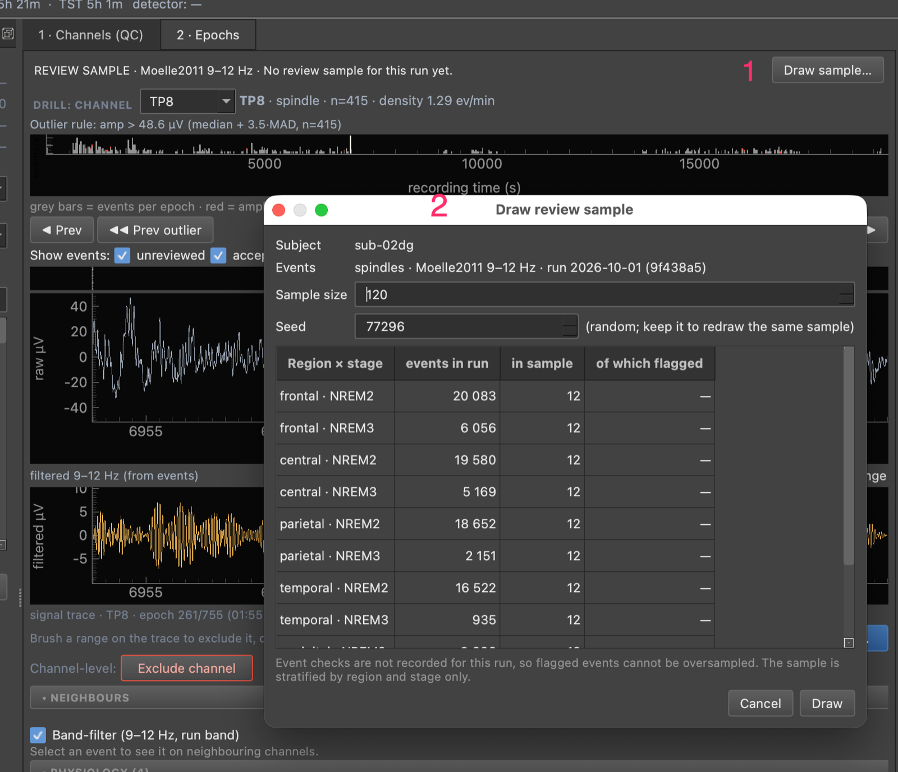
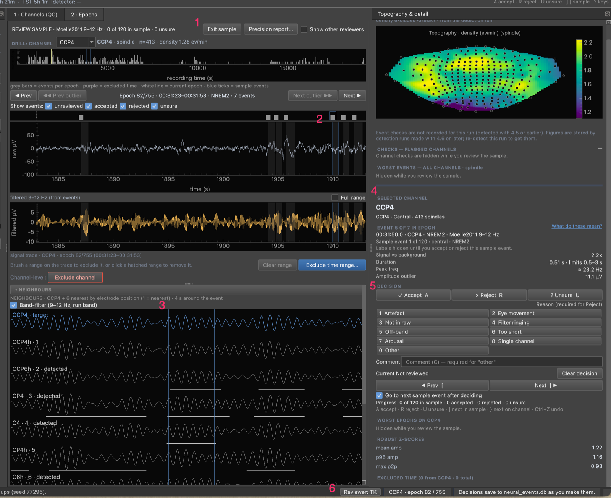
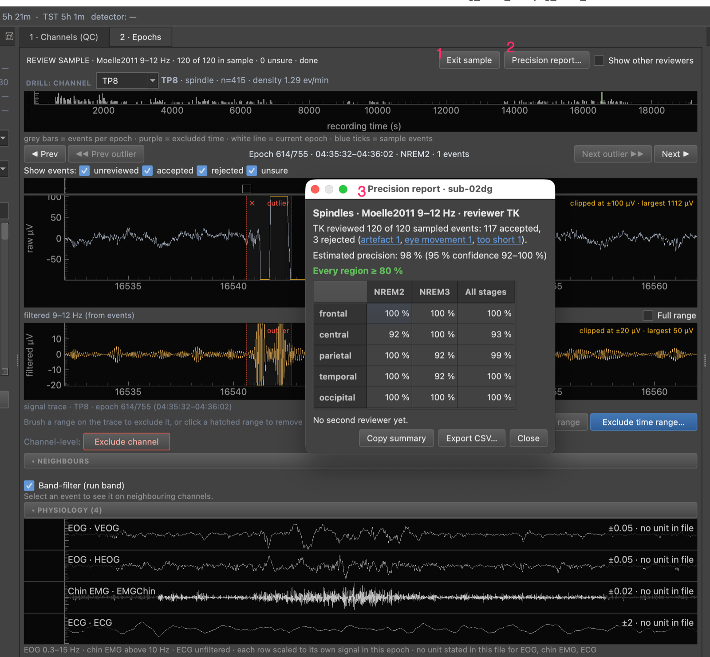

# How to Validate a Detection Run

Use this to answer two questions about one subject's detection run: does any
channel pick up something that is not the event (for example posterior alpha in
a spindle band), and what share of the detected events would a trained reviewer
accept? A night holds tens of thousands of events, so nobody decides them all.
You check channels from stored figures, then label a drawn sample of about 120
events.

Prerequisites:

- A database from a 4.6 detection run. Figures are stored at detection time; a
  run from 4.5 or earlier shows "not recorded" (see
  [Upgrade to 4.6](upgrade-to-4.6.md)).
- The review GUI open on that database (`eeg_review_gui`), with the EEG file
  loaded to see traces.
- A reviewer name set under **Review ▸ Reviewer name…**.

To judge one event once it is on screen, see
[Decide whether an event is genuine](decide-if-an-event-is-genuine.md).

## Run the population checks on the Channels tab

The Channels (QC) tab table has eight columns, all about amplitude and event
counts. The channel checks, which compare each channel's events with the rest of
the montage, are computed in a background thread from the stored figures and
shown in two places: the metrics on the topography and the **CHECKS — FLAGGED
CHANNELS** list under it.

| Check | What it is | What it says |
|---|---|---|
| Off-band share | share of events whose peak frequency, after removing the 1/f background, lies outside the run band | the channel picks up a rhythm outside the band |
| At-floor share | share within 0.05 s of the run's minimum duration | many short events at the limit |
| Amp vs background | median event band RMS over the surrounding background RMS | near 1 means events barely stand out |
| Amp vs threshold | median detection peak over the detection threshold | near 1.0 means most events only just crossed the bar |
| Low-prominence share | share whose spectral peak stands under 10 dB above the 1/f background | context only; follows signal-to-noise |

To read them:

1. Choose the **Stage** button for the stages you want, or leave the combined
   `NREM2 + NREM3` button. It sets the topography metrics and the list; the table
   follows the Filters dock.
2. Switch the topography combo to `Off-band share`. Channels with a check carry a
   ring, and up to 12 carry their name.
3. Click `n checks flagged` in the count line above the table to jump to the
   list. Use **Show** set to `Amp flagged` to hide the channels the amplitude
   flag does not mark.
4. Read the flagged-channel list. It states facts only, for example `34 % of
   spindles off-band · 61 % of those peak at 8–9 Hz`. The most common 1 Hz bin
   appears when the channel has at least 10 off-band events (the library reports
   it from 5); hover the row for the share below and above the band. What those
   peaks are is for you to decide: the list never says.
5. Select a channel and use the bottom bar: **Open in Epochs**, **Exclude
   channel** or **Add to re-detect queue** (the `F` key does the same). Excluding
   leaves the channel out of review samples, the re-run export, the flag
   statistics and the topography; it does not change event density or exported
   events.

**How a channel is listed.** There are no fixed thresholds, and no footer line:
hover the list header for the rule. Each channel is compared with the rest of the
montage. It is listed when its off-band or at-floor share is well above the
montage median, or its median signal vs background or amp vs threshold is well
below it: hard when the robust z is above the hard limit, soft when above the soft
limit (set under **View ▸ Outlier threshold…**), and only if it also differs from
the median by at least 10 percentage points (shares) or 0.3× (ratios) and has at
least 20 events. A problem every channel shares produces no entries, so a uniform
topography also deserves a look, and the Precision report is where it shows.

**Low prominence never flags.** It tracks a channel's signal-to-noise more than
any off-band rhythm: in synthetic tests, weak genuine spindles under 1 s were
labelled low-prominence a third to a half of the time. It stays as a topography
choice for context.

To list the events behind a flagged check, press **Open in Epochs** (it filters
to the channel's largest-z flagged check). The Epochs tab then shows a removable
chip such as `Showing off-band spindles only (117 of 344) ✕`, and `}` and `{`
step through those events only. `Esc` removes the filter.

The amplitude `Amp flag` is a separate, table-only flag (hover its header for the
rule). **Queue all HARD** uses it, not the channel checks.

## Draw a review sample

The sample is a stratified random draw of 120 events per detection scope.

- **Scope.** One subject, event type, method, band and stage token, across
  every run in it. Two runs with identical parameters are one population.
- **Strata.** Five scalp regions (frontal, central, parietal, temporal,
  occipital) times two stages (NREM2, NREM3). Each cell gets an equal share.
  Channels marked `drop` in the QC tab, other regions and other stages are left
  out and counted in the design.
- **Flagged oversampling.** In each cell, flagged events take at least half the
  slots (more if their share is larger). Each sampled event carries a weight, so
  the precision estimate is not biased by this. An event is flagged when it is
  off-band, low-prominence (spindles only), has `amp_ratio` under 2.0 or missing,
  or is near a splice.
- **Seed.** The library default is 1; the GUI dialog seeds randomly, so note the
  seed it shows. The same seed on the same population returns the
  same sample and the same `sample_id`. Any change to the population gives a new
  id.

To draw it in the GUI:

1. Open the **Epochs** tab and find the `REVIEW SAMPLE` bar.
2. Click **Draw sample…** (or **Review ▸ Draw review sample…**).
3. Check the preview of events per region and stage, keep size 120, and note the
   seed. Keep the seed to redraw the same sample. A dialog note says when a
   sample already exists for this run.
4. Click **Draw**. The sample starts and its first event is selected. Drawing
   again keeps the old sample and its decisions; the Precision report uses the
   newest. If the run has no stored figures, the dialog says the sample is
   stratified by region and stage only.



*The Draw review sample dialog, opened from the Epochs tab.*

1. **Draw sample…**, on the `REVIEW SAMPLE` bar, which reads `No review sample
   for this run yet.`
2. The `Draw review sample` dialog: the `Subject` and `Events` lines (here
   `sub-02dg` and `spindles · Moelle2011 9–12 Hz · run 2026-10-01 (9f438a5)`),
   **Sample size** (`120`), **Seed** (`77296`, with the note `random; keep it
   to redraw the same sample`), the table of `Region × stage`, `events in
   run`, `in sample` and `of which flagged`, and **Cancel** and **Draw**. The
   note under the table says that event checks are not recorded for this run,
   so the sample is stratified by region and stage only.

The preview in the dialog comes from the library. To see the allocation from
Python without writing anything, call `preview_allocation` with the same
arguments as `draw_review_sample`; it returns the cells with their sizes and
sample counts.

To draw it from Python:

```python
from turtlewave_hdEEG import draw_review_sample
from turtlewave_hdEEG.dbwrite import open_write_connection

conn = open_write_connection('wonambi/neural_events.db')
sample_id = draw_review_sample(conn, run_id='<any run of the scope>',
                               event_type='spindle', n_total=120, seed=1)
```

To list every stored label on a sample, with the rules that void a stale one,
call `read_sample_labels(conn, sample_id)`. The valid labels of a reviewer number
`sample_progress(...)['n_reviewed']`.

`draw_review_sample` raises on an empty scope (including EGI `E<n>` labels,
which map to region `other`), when the runs of the scope have different
parameters (unless `allow_mixed_params=True`), and when `n_total` is under
twice the number of non-empty cells.

A scope detected before 4.6 has no stored figures. It is stratified by region
and stage only, nothing is flagged, and a warning is logged. Call
`top_up_region(conn, sample_id, region)` once per region to add 12 events when a
region needs more.

## Review the sample

1. Press `]` to go to the next sample event you have not decided. The GUI moves
   to the right channel and epoch. Events come in a presentation order that is
   balanced across the groups (rank within each sub-cell, then cell), so
   stopping early still leaves a balanced set. It is not ordered by channel,
   and every reviewer sees the same order. `[` goes back.
2. Apply the six checks, then press `A`, `R` or `U`. With **Go to next sample
   event after deciding** on (the default), the next sample event is selected.
3. Use `}` and `{` to step through all events on the drilled channel, in the
   sample or not; `]` returns to the next undecided sample event.
4. While you review, the Event panel hides every flag word and keeps every
   number: `in band` / `OFF BAND`, `low prominence`, `at the floor`, `barely
   above background`, `meets` / `fails`, and the `flagged: off-band` part of the
   Sample row. A line says `Labels hidden until you accept or reject this sample
   event.` The words appear after you accept or reject, and an unsure does not
   reveal them. This keeps the stratifier from steering your decision.
   The right dock likewise hides channel-level flags while the sample is
   active (the flagged-channel list, topography rings and the amplitude flag
   text); they return on **Exit sample**.
5. When the last event is decided, the Event panel says so and offers
   **Open precision report** and, if any were unsure, **Revisit the unsure**.
   While you work, the bar shows the time left at your own pace; the done state
   shows `· done` with no estimate.



*A sample event under review, before any decision.*

1. The `REVIEW SAMPLE` bar in sample mode: `0 of 120 in sample · 0 unsure`, with
   **Exit sample**, **Precision report…** and **Show other reviewers**.
2. The event row above the raw trace: one square per event in this epoch; the
   outlined one is the selected event. Sample events are the blue ticks on the
   epoch strip.
3. The **Neighbours** group, open for `CCP4`.
4. **SELECTED CHANNEL** and **EVENT 5 OF 7 IN EPOCH**, with the line `Sample
   event 1 of 120 · central · NREM2` and `Labels hidden until you accept or
   reject this sample event.`
5. **DECISION**, with `Progress  0 of 120 in sample` and the checkbox **Go to
   next sample event after deciding**.
6. The status bar: `Reviewer: TK`, the channel and epoch, and `Decisions save to
   neural_events.db as you make them.`

Decisions on events outside the sample are saved, and the status line says
`Saved, outside the review sample: not counted in precision.`

For a second rater:

1. The second rater opens the same database, sets their own name and presses
   **Resume sample**. Every reviewer gets the full sample, in the same order,
   with their own progress.
2. Thirty events form a shared subset (`ceil(30 / cells)` per cell, chosen by a
   second hash). The subset exists for the agreement figure; it is not the
   second rater's whole task. Neither rater is told which events are shared.
3. Other reviewers' decisions are hidden by default: bands, the Current line,
   progress and the undecided count show only your own. Turn on **Show other
   reviewers** only when adjudicating. It is off at every launch.

!!! warning "A free-browsing decision counts toward the sample"
    The `event_reviews` table has no `sample_id` column in 4.6. A decision on an
    event that happens to be in a sample counts toward that sample, whether you
    made it from the sample or while browsing a channel. Decisions are matched by
    event uuid, and an event whose end time moved by more than 0.05 s since the
    draw is treated as not reviewed. Do browsing review on a copy, or accept that
    any decision on a sampled event is a label for it. The same holds for
    decisions made while other reviewers' decisions were visible: 4.6 does not
    record that, so they are not excluded from agreement.

## Read the precision report

Precision here means: of the events the detector found, the share a reviewer
accepted. Unsure events are left out of the denominator and counted separately.

From Python:

```python
from turtlewave_hdEEG import compute_review_precision

df = compute_review_precision(conn, sample_id, reviewer='TK')
print(df[['domain_type', 'domain', 'p_hat', 'ci_lo', 'ci_hi',
          'n_eff', 'unsure_rate', 'verdict']])
```

The frame has one row per domain: `scope/all`, each region, each region and
stage, `flagged`, `unflagged`, `near_splice` and a `flagged-unflagged`
difference. The rows are also written to the `review_precision` table, replacing
the previous rows of that sample, reviewer and label source.

In the GUI, **Precision report…** (on the bar and under **Review**) opens a
short, non-modal window that refreshes when a decision is written in sample mode,
or undone, and writes `review_precision` rows each time. A decision made while
free-browsing, or **Clear**, leaves an open report stale until you reopen it.



*The Precision report opened over a finished sample.*

1. **Exit sample**, on the `REVIEW SAMPLE` bar, which reads `120 of 120 in
   sample · 0 unsure · done`.
2. **Precision report…**, on the same bar.
3. The window `Precision report · sub-02dg`: the sentence `TK reviewed 120 of
   120 sampled events: 117 accepted, 3 rejected (artefact 1, eye movement 1,
   too short 1)`, `Estimated precision: 98 % (95 % confidence 92–100 %)`, the
   green verdict `Every region ≥ 80 %`, the region by stage table, `No second
   reviewer yet.`, and the buttons **Copy summary**, **Export CSV…** and
   **Close**.

The window shows, top to bottom:

- a title line (event type, method and band, reviewer) and one sentence: `TK
  reviewed 120 of 120 sampled events: 117 accepted, 3 rejected (artefact 1, eye movement 1,
  too short 1).`
  The reasons are links: click one to list those events (`Rejected as artefact
  (1)`), and double-click a row to open that event in the Epochs tab. Click the
  link again to close the list;
- `Estimated precision: 98 % (95 % confidence 92–100 %)`, weighted to all of the
  night's events, with unsure events left out;
- a verdict: `Every region ≥ 80 %`, or `Check parietal · NREM2 (54 %): below
  80 %.` Groups with fewer than 10 decided events show `—` and
  are not judged;
- a region by stage table of percentages (hover a cell for the confidence range
  and counts; a cell below the rule reads `54 % ▼`);
- a second-reviewer line. With one reviewer: `No second reviewer yet.` With two,
  the line stays `{B} has also reviewed this sample. Agreement is shown once you
  have decided all {n} events.` until you have decided every sampled event, so
  the other reviewer's decisions cannot influence yours; the reviewer picker is
  disabled until then too. After that it gives percent agreement on the events you
  both decided (three-way: accept, reject, unsure) and Cohen's kappa (which leaves
  out events either reviewer marked unsure);
- **Copy summary** (four lines of text), **Export CSV…** and **Close**.

The threshold (default 80 %) and whether it applies to the point estimate or the
lower 95 % bound are set in **Review ▸ Precision rule…**, not in the report. The
window applies only this rule. The `TRUSTWORTHY`, `EXCLUDE` and `TOP_UP`
verdicts below and `top_up_region` have no GUI yet; use Python.

How to read it:

- `p_hat` is the design-weighted share accepted. `ci_lo` and `ci_hi` are a 95 %
  Wilson interval on the effective sample size `n_eff`, which is smaller than the
  number of events because of the weights.
- `unsure_rate` is the weighted share of unsure events. `p_lo_bound` and
  `p_hi_bound` treat all unsure events as rejects, then as accepts.
- A cell with fewer than 8 events is a census and is labelled so. A domain with
  an unlabelled sub-cell reads `INCOMPLETE`.
- With about 120 events a region has an effective sample of 18 to 24 events. A
  lower bound of 0.70 then needs a point estimate near 0.90. A sample of this
  size can show that a region is bad. It cannot certify that one is good.
- The `flagged-unflagged` difference checks that the figures separate good from
  bad events. A difference near zero means the flag adds little.

### The trustworthiness rule is a lab convention

The `verdict` column applies a rule that is not a published standard. The
defaults are in `turtlewave_hdEEG.review_sampling.POOLING`:

- The scope is `TRUSTWORTHY` when `p_hat` is at least 0.80, the lower bound is at
  least 0.70 and the unsure rate is at most 0.15. Otherwise `NOT_TRUSTWORTHY`.
- A region is `EXCLUDE` when its upper bound is under 0.70. It is `TOP_UP` when
  `p_hat` is under 0.70 but the upper bound is 0.70 or more, and it has not been
  topped up. Otherwise it is `IN`.
- Drug and placebo nights pool when both are trustworthy, the same regions are
  `IN`, and the interval for their difference (`mover_difference`) includes 0.
  Otherwise report density times precision beside raw density.

Change the numbers to suit your lab and state them in your methods. The top-up
step and the difference test have not been simulated.

### Check agreement between raters

```python
from turtlewave_hdEEG import label_agreement

out = label_agreement(labels_primary, labels_second)   # uuid -> decision
print(out['percent_agreement'], out['kappa'], out['protocol_pass'])
```

The protocol check is a convention: kappa at least 0.60 and agreement at least
0.80, otherwise retrain on the disagreements before using any precision figure.
At an accept rate near 0.8, kappa is low even when agreement is high, so read
`positive_agreement` and `negative_agreement` too.

## Leave rejected events out of density or an export

Rejected events stay in the database. To leave them out of a number, ask for it:

```python
from turtlewave_hdEEG import event_density

df = event_density('wonambi/neural_events.db', event_type='spindle',
                   exclude_rejected=True, reviewer='TK')
```

`exclude_rejected` is off by default. With `reviewer=None` an event any reviewer
rejected is left out. The denominator does not change. `export_events_to_csv`
takes the same two arguments, and the `events_reviewed` view keeps only events
no reviewer rejected. Because the sample is about 120 events of tens of
thousands, excluding rejections removes almost nothing. Use precision, not
exclusion, to correct a night's counts.

## See also

- [Decide whether an event is genuine](decide-if-an-event-is-genuine.md)
- [Event figures and review sampling](../explanation/event-figures-and-review-sampling.md)
- [Review sampling API](../reference/api/review_sampling.md)
- [Reference: EEG Review GUI](../reference/eeg-review-gui.md)
