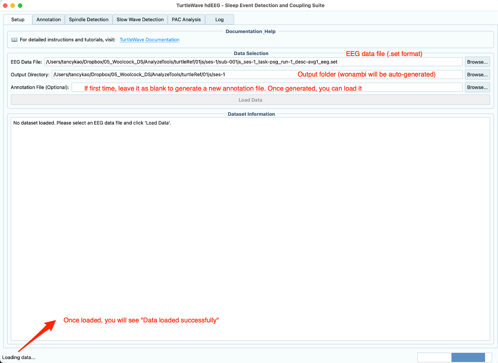

# TurtleWave Documentation Images

This directory contains screenshots and images used in the documentation.

## Image Naming Convention

Use descriptive, lowercase names with hyphens:

- `gui-setup-tab.png` - Setup tab interface
- `gui-data-loaded.png` - Data loaded successfully
- `gui-spindle-detection.png` - Spindle detection tab
- `gui-slow-wave-detection.png` - Slow wave detection tab
- `gui-pac-analysis.png` - PAC analysis tab

## Required Screenshots

Based on the tutorial and how-to guides, we need:

### Setup Tab
- `gui-setup-tab.png` - Main setup interface showing file selection
- `gui-data-loaded.png` - Interface after data is loaded successfully

### Detection Tabs
- `gui-spindle-detection.png` - Spindle detection parameters and interface
- `gui-slow-wave-detection.png` - Slow wave detection parameters
- `gui-pac-analysis.png` - PAC analysis interface

### Results
- `gui-detection-progress.png` - Detection in progress
- `gui-results-panel.png` - Results display

## Image Guidelines

**Format:** PNG (for screenshots)  
**Size:** Keep under 500KB when possible  
**Resolution:** Capture at actual size (don't upscale)  
**Content:** Show relevant interface elements clearly

## Adding Images to Documentation

In markdown files, reference images like this:

```markdown

```

For images with captions:

```markdown

*The Setup tab where you load data and set output directory*
```

## Current Images

Place the GUI screenshots you have in this directory with appropriate names:

1. First image (Setup tab with data loaded) → `gui-setup-data-loaded.png`
2. Second image (Detection tabs) → `gui-detection-tabs.png`