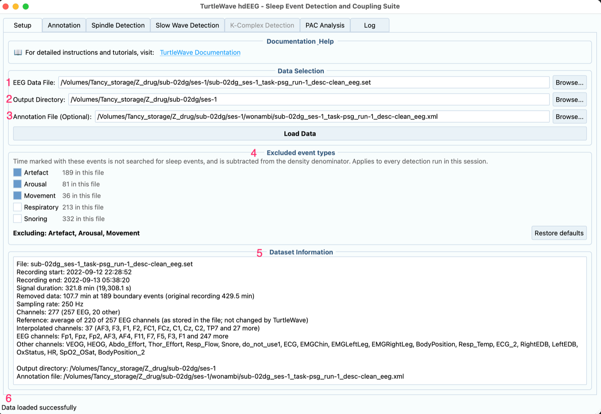

# TurtleWave Documentation Images

This directory holds the screenshots and diagrams used in the documentation.

## Naming convention

Screenshots are named `gui_<area>_<what>_v<version>.png`, in lowercase with
underscores except for camelCase in `<what>` where it already exists. The version
is the TurtleWave release the screenshot was taken from, so a stale screenshot
can be found after a release.

- `<area>` is `setup`, `annotation`, `spindle`, `slowwave`, `pac` (detection GUI,
  `turtlewave_gui`) or `review` (review GUI, `eeg_review_gui`).
- `<what>` says what the screenshot shows, for example `channels` or
  `event_precision_report`.

## Image guidelines

- Format: PNG.
- Width: at most 1600 px. Shrink in place with `sips -Z 1600 <file>` (macOS).
- Numbered red markers on a screenshot must be explained by a numbered list
  directly under the image.
- Keep home-folder paths and personal names out of the shot. Use initials.

## Using an image in a page

```markdown


*The Setup tab after a recording has been loaded.*

1. **EEG Data File**: the recording to analyse.
```

Leave a blank line before and after the image, the caption and the list.

## Current screenshots (4.6.0)

| File | Used on |
|---|---|
| `gui_setup_tab_v4.6.0.png` | `tutorials/getting-started.md` |
| `gui_annotation_v4.6.0.png` | `tutorials/getting-started.md` |
| `gui_spindle_v4.6.0.png` | `tutorials/getting-started.md`, `how-to/detect-spindles.md` |
| `gui_spindle_detInfo_v4.6.0.png` | `tutorials/getting-started.md`, `how-to/detect-spindles.md` |
| `gui_spindle_detLogInfo_v4.6.0.png` | `tutorials/getting-started.md`, `how-to/detect-spindles.md` |
| `gui_slowwave_v4.6.0.png` | `how-to/detect-slow-waves.md` |
| `gui_pac_v4.6.0.png` | `how-to/run-pac-analysis.md` |
| `gui_review_channels_v4.6.0.png` | `reference/eeg-review-gui.md`, `tutorials/eeg-review-gui-tutorial.md` |
| `gui_review_event_v4.6.0.png` | `reference/eeg-review-gui.md`, `tutorials/eeg-review-gui-tutorial.md` |
| `gui_review_event_det_neighbors_v4.6.0.png` | `how-to/decide-if-an-event-is-genuine.md` |
| `gui_review_event_physiology_v4.6.0.png` | `how-to/decide-if-an-event-is-genuine.md` |
| `gui_review_event_reject_v4.6.0.png` | `how-to/decide-if-an-event-is-genuine.md` |
| `gui_review_event_reject2_v4.6.0.png` | `how-to/review-eeg-events.md` |
| `gui_review_event_excludeTimeRange_v4.6.0.png` | `how-to/review-eeg-events.md` |
| `gui_review_event_excludeTimeRange2_v4.6.0.png` | `how-to/review-eeg-events.md`, `how-to/rerun-detection-on-channels.md` |
| `gui_review_event_exportReRunpackage_v4.6.0.png` | `how-to/rerun-detection-on-channels.md` |
| `gui_review_draw_sample_v4.6.0.png` | `how-to/validate-a-detection-run.md` |
| `gui_review_draw_sample2_v4.6.0.png` | `how-to/validate-a-detection-run.md` |
| `gui_review_event_precision_report_v4.6.0.png` | `how-to/validate-a-detection-run.md`, `reference/eeg-review-gui.md` |

## Other images

`workflow_overview.png`, `workflow_ecosystem.png` and `sw_spindle_coupling.png`
are diagrams. The `.py` files next to them regenerate them.
