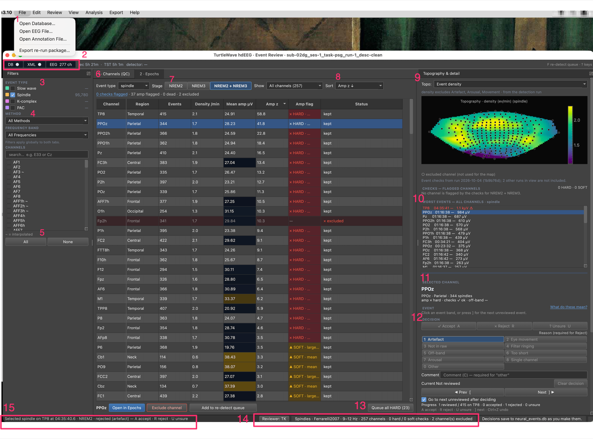
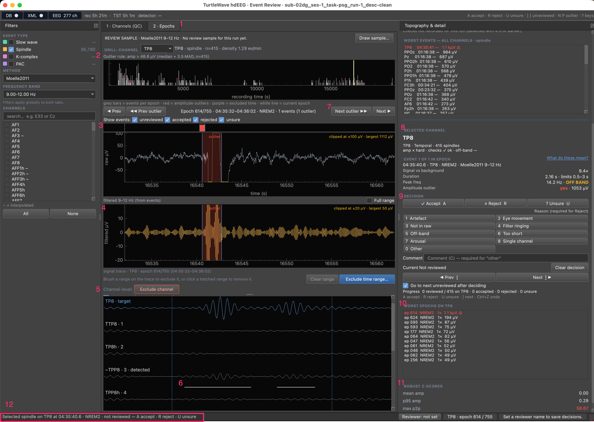

# Tutorial: Your First EEG Event Review Session

Welcome! In this tutorial, we'll walk through your first QC pass with the TurtleWave EEG Review GUI. By the end, you'll have triaged real channels and know how to flag one for re-detection.

!!! note "What you'll learn"
    - How to launch the EEG Review GUI
    - How to load your data files
    - How to read the Channels (QC) dashboard
    - How to drill into a channel's epochs
    - How to flag a channel for re-detection and export a QC report

!!! tip "Before you start"
    Make sure you have:

    - TurtleWave installed (`pip install turtlewave-hdEEG`)
    - An event database file (`neural_events.db` from event detection)
    - The corresponding EEG data file (`.set` or `.fdt` format)
    - Optional: Sleep stage annotation file (`.xml` format)

## Step 1: Launch the GUI

Open your terminal and run:

```bash
eeg_review_gui
```

The application window opens with two tabs — **1 · Channels (QC)** and
**2 · Epochs** — plus a left filter dock and a right dock carrying
topography, the global worst-events list, and channel detail.

!!! success "What you should see"
    A window titled "TurtleWave hdEEG · Event Review". The interface is
    empty because we haven't loaded any data yet.

## Step 2: Load Your Data

1. **File → Open Database…** and select your `neural_events.db`
2. **File → Open EEG File…** and select the matching `.set`/`.fdt` file
3. **File → Open Annotation File…** (optional) to load sleep stages

The toolbar LEDs (DB / XML / EEG) light up as each source loads, and the
Channels (QC) tab populates with one row per channel.

!!! success "What you should see"
    The Channels (QC) table fills with rows, each showing an outlier flag,
    event count, density, and amplitude for the current event type.

## Step 3: Read the QC Dashboard

The **Channels (QC)** tab is the landing surface. Each row is a channel, not
an individual event — this is a QC triage view, not a per-event review list.
The table has eight columns: channel, region, event count, density, mean
amplitude, a robust z-score of that amplitude, an amplitude flag and a status.
Hover the `Amp flag` header to see how the flag is decided. Channel checks (for
example the share of events whose peak lies outside the band) are listed under
the topography; the `n checks flagged` link above the table takes you there. The
**Stage**, **Show** and **Sort** controls above the table change what you see.



*The Channels (QC) tab with a spindle run loaded.*

1. **File** menu, open: **Open Database…**, **Open EEG File…**, **Open Annotation File…** and **Export re-run package…**.
2. The source indicators `DB`, `XML` and `EEG 277 ch` in the top bar, with the
   recording length (`rec 5h 21m`) and total sleep time (`TST 5h 1m`) beside
   them.
3. **EVENT TYPE** in the Filters dock: **Slow wave**, **Spindle** (ticked, with
   its event count), **K-complex** and **PAC**.
4. **METHOD** (`All Methods`) and **FREQUENCY BAND** (`All Frequencies`) lists.
5. **CHANNELS**: a search box, the channel list with `~` marking interpolated
   channels, and the **All** and **None** buttons.
6. The **1 · Channels (QC)** tab, next to **2 · Epochs**.
7. **Stage** buttons: `NREM2`, `NREM3` and `NREM2 + NREM3`.
8. The **Show** (`All channels (257)`) and **Sort** (`Amp z ↓`) lists.
9. The **Topography & detail** dock, with the topography list set to `Event
   density` and the scalp map below it.
10. **WORST EVENTS — ALL CHANNELS · spindle**: the global list; a click jumps to
    that channel and epoch.
11. **SELECTED CHANNEL**: the detail of the channel selected in the table
    (`PPOz`).
12. The **EVENT** and **DECISION** panels. They are inactive here because no
    event is selected; select one on the Epochs tab.
13. **Queue all HARD (23)**, in the bar under the table beside **Open in
    Epochs**, **Exclude channel** and **Add to re-detect queue** for the
    selected channel.
14. The status bar summary: reviewer, event type, method, band, channel count,
    check counts and `channel(s) excluded`.
15. The status-bar message about the selected event.

Use the left filter dock to switch event type (spindle / slow wave /
K-complex / PAC) and to narrow by method or frequency band. Channels flagged
as outliers (hard or soft, based on a robust z-score against the rest of the
montage) sort to the top.

!!! tip "What to observe"
    Click a row to populate the right-hand detail dock with that channel's
    topography position and worst events. Click a row in the global
    worst-events list to jump straight to a channel.

## Step 4: Drill into a Channel's Epochs

1. Select a channel in the QC table
2. Click **Open in Epochs** under the table (this switches you to the **2 · Epochs** tab)

The Epochs panel steps through 30-second windows for that channel, with a
hypnogram strip and outlier markers. Use **P**/**N** to jump between outlier
epochs, or the prev/next buttons to step one epoch at a time.

!!! success "What you should see"
    The epoch strip highlights outlier windows. Stepping through lets you
    confirm whether a flagged channel's events look like real detections or
    artefact.

## Step 5: Look at One Event and Record a Decision



*The Epochs tab with one outlier event selected on channel TP8.*

1. The **2 · Epochs** tab.
2. The drill header (`DRILL: CHANNEL`, `TP8 · spindle · n=415 · density 1.29
   ev/min`), the `Outlier rule` line and the epoch strip below them.
3. The **Show events** row: `unreviewed`, `accepted`, `rejected`, `unsure`.
4. The `filtered 9–12 Hz (from events)` trace under the raw trace, with its
   **Full range** checkbox. The `clipped at …` note on each trace shows when a
   sample lies beyond the drawn range.
5. **Channel-level: Exclude channel**, under the **Clear range** and **Exclude
   time range…** row.
6. The **Neighbours** rows: `TP8 · target`, then the nearest channels by rank,
   with a bar under a trace where an event was detected on that channel.
7. The epoch navigation: **Prev**, **◀◀ Prev outlier**, **Next outlier ▶▶**
   and **Next**, with the epoch label `Epoch 614/755 · 04:35:32–04:36:02 ·
   NREM2 · 1 events (1 outlier)`.
8. **SELECTED CHANNEL** and **EVENT 1 OF 1 IN EPOCH**: `Signal vs background`,
   `Duration`, `Peak freq` and `Amplitude outlier`.
9. **DECISION**: **Accept A**, **Reject R**, **Unsure U**, the reason grid, the
   comment field, **Prev** and **Next**, and the progress line.
10. **WORST EPOCHS ON TP8**.
11. **ROBUST Z-SCORES**: `mean amp`, `p95 amp` and `max p2p`.
12. The status-bar message for the selected event.

1. In the Epochs tab, click one of the shaded bands on the raw trace. We've
   selected an event, and the **Event** panel in the right dock fills with
   four rows: Signal vs background, Duration, Peak freq and Amplitude outlier.
2. Press **Review ▸ Reviewer name…** and enter your initials if the GUI hasn't
   asked yet. Nothing is saved without a name.
3. Look at the raw trace, then the figures, and press `A` to accept the event.
4. Select another event, press `R`, then `1` to reject it as an artefact.
5. Press `Ctrl+Z` (`Cmd+Z` on macOS) to undo the last decision.
6. Notice that only the saved decision looks selected: on an undecided event none of the three buttons is highlighted.
7. Press `?` to open the keys cheat sheet, and `?` or `Esc` to close it.

!!! success "What you should see"
    The accepted band turns green with a ✓. The `Current` line in the dock reads
    `Accepted by` and your name. The rejected band shows a dashed edge and a ✗,
    and after the undo it goes back to its previous style.

These decisions are stored in the database beside the events, and no event is
removed. A handful of decisions only teaches the keys; to measure how often the
detector is right, work through a drawn sample (see the
[how-to guides](../how-to/validate-a-detection-run.md)).

## Step 6: Flag a Channel for Re-detection

Once you've decided a channel needs re-running with different parameters
(or excluded from the analysis with **Exclude channel**):

1. Select the channel in the Channels (QC) table
2. Press **F** (or use **Edit → Flag selected channel for re-detect**)

The channel is added to the re-detect queue, its Status reads `kept · ↻
re-detect`, and the queue is saved in the database. Repeat for as many channels
as needed, then choose **File → Export re-run package…** to hand them off to a
re-run.

## Step 7: Export a QC Report

When you're done triaging:

1. **Export → Export QC report…**
2. Choose a location and filename

This writes a Markdown summary of the per-channel QC table, flagged
channels, and excluded time ranges for the current event type.

!!! success "What you've created"
    A Markdown report you can attach to a study log or share with a
    collaborator, plus a re-detect queue ready to build into a scoped rerun.

## What You've Accomplished

Congratulations! You now know how to:

✅ Launch the GUI and load your data files
✅ Read the Channels (QC) dashboard and spot outlier channels
✅ Drill into a channel's epochs to inspect individual windows
✅ Select an event, record a decision and undo it
✅ Flag a channel for re-detection with `F`
✅ Export a QC report

## Next Steps

- **Solve specific QC tasks** — see the [How-to Guide](../how-to/review-eeg-events.md)
- **Judge an event** — [Decide whether an event is genuine](../how-to/decide-if-an-event-is-genuine.md)
- **Validate a run** — [Validate a detection run](../how-to/validate-a-detection-run.md)
- **Understand the design** — see the [Explanation](../explanation/eeg-review-gui-architecture.md)
- **Upgrading from a pre-4.0 project** — the 4.0 workflow replaced the old
  per-event review GUI (4.6 added event decisions back as validation); see
  [How to Upgrade to turtlewave-hdEEG 4.0](../how-to/upgrade-to-4.0.md#step-5-adjust-to-the-review-gui-workflow-change)
  for what changed and why.
