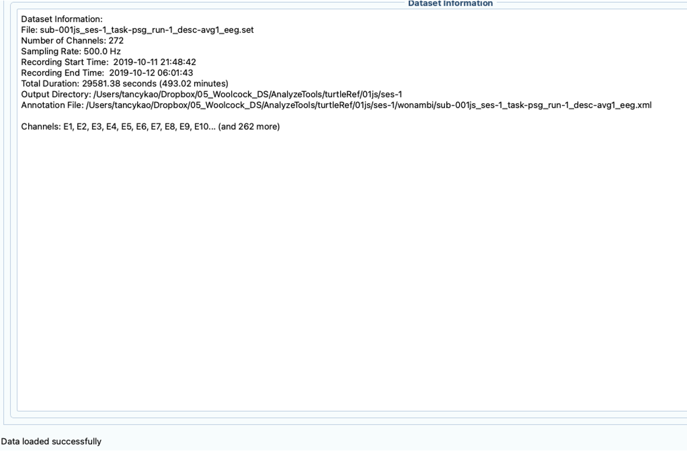
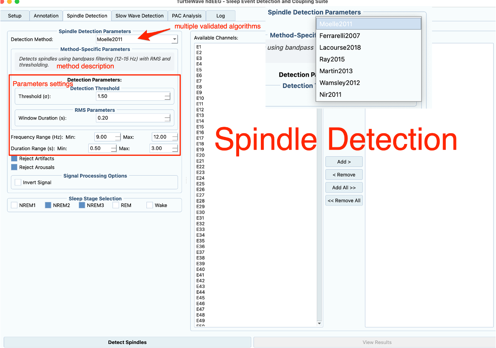

# Getting Started with TurtleWave hdEEG

Welcome! In the next 15 minutes, you'll go from zero to detecting sleep events in real EEG data. By the end of this tutorial, you'll understand the complete TurtleWave workflow and have working results you can build on.

!!! tip "First time with sleep EEG analysis?"
    Perfect! This tutorial assumes no prior experience. We'll explain everything as we go, and you'll learn by doing rather than reading theory.

## What You'll Accomplish

By following this tutorial, you will:

1. Launch the TurtleWave GUI and understand its interface
2. Load a sleep EEG recording
3. Generate automated sleep annotations
4. Detect sleep spindles in your data
5. Understand and locate your results

**Time needed:** 15 minutes  
**Prerequisites:** TurtleWave installed ([installation guide](../how-to/installation.md))

Let's dive in!

## Step 1: Launch the TurtleWave GUI

Open your terminal and type:

```bash
turtlewave_gui
```

The TurtleWave window should appear within a few seconds.

!!! success "GUI launched successfully?"
    Great! You should see the main interface with several tabs: Annotation, Spindle Detection, Slow Wave Detection, and PAC Analysis.

!!! warning "GUI didn't launch?"
    If nothing happens, verify your installation:
    ```bash
    python -c "import turtlewave_hdEEG; print('Installation OK')"
    ```
    If this fails, revisit the [installation guide](../how-to/installation.md).

### Understanding the Interface

Take a moment to familiarize yourself with the layout:

- **Top section** - File selection and output directory
- **Tab area** - Different analysis types (Annotation, Spindle Detection, Slow Wave Detection, PAC Analysis)
- **Bottom panel** - Status messages and progress


*The main TurtleWave interface showing the Setup tab*

You'll spend most of your time in the top section and the Annotation tab.

## Step 2: Load Your EEG Data

Now let's load some data to analyze.

### Select Your EEG File

1. Click the **"Select EEG File"** button (top left)
2. Navigate to your EEG data file
3. Select a file with extension `.edf`, `.set`, or `.fif`
4. Click **"Open"**

The file path should now appear in the interface.

!!! example "Don't have data handy?"
    No problem! TurtleWave includes test data in the `tests/` directory of your installation. Look for files like `synthetic_sleep_eeg.set` to practice with.

### Set Your Output Directory

Results need somewhere to go:

1. Click **"Select Output Directory"**
2. Choose a folder where you want results saved
3. Click **"Select Folder"**

!!! tip "Organization tip"
    Create a dedicated `results/` folder for each subject or recording session. This keeps your analysis organized as your project grows.

You should now see both paths displayed in the GUI, along with dataset information on the right panel.


*Interface after successfully loading EEG data - note the dataset information panel on the right*

You're ready to process!

## Step 3: Generate Sleep Annotations

Before detecting events, we need to know which parts of the recording contain which sleep stages. This is what annotation does.

### Why Annotations Matter

Think of annotations as a map of your recording. Without them, TurtleWave would search for sleep spindles everywhere—including wake periods where they don't occur. Annotations make detection faster and more accurate.

### Run the Annotation

1. Navigate to the **Annotation** tab (should already be selected)
2. Review the default settings (they work well for most cases)
3. Click **"Generate Annotations"**

The process will start, and you'll see progress updates in the status panel.

!!! note "What's happening behind the scenes"
    TurtleWave is analyzing your data to identify:
    
    - **Artifacts** - Signal issues that could interfere with detection
    - **Arousals** - Brief awakenings that fragment sleep
    - **Sleep stages** - Wake, N1, N2, N3, and REM periods

This typically takes 2-5 minutes depending on your recording length.

### Confirm Success

Wait for the message: "Annotation complete"

!!! success "Annotation finished?"
    Excellent! You've completed the foundation step. The annotations are automatically saved in your output directory as an XML file.

## Step 4: Detect Sleep Spindles

Now for the exciting part—detecting actual sleep events!

### What Are Sleep Spindles?

Sleep spindles are brief bursts of brain activity (11-16 Hz) that occur during sleep, particularly in stage N2. They're important markers of memory consolidation and sleep quality.

### Configure Detection

1. Switch to the **Spindle Detection** tab
2. Review the default parameters:
    - **Frequency range:** 11-16 Hz (typical for spindles)
    - **Duration:** 0.5-2.0 seconds
    - **Detection threshold:** Default (works for most data)

For this tutorial, keep the defaults—they're optimized for typical sleep recordings.


*Spindle Detection tab showing parameter options and channel selection*

!!! tip "About these parameters"
    The defaults work well for most adult sleep data. As you gain experience, you might adjust these based on your specific research questions or population characteristics.

### Run Detection

Click **"Run Spindle Detection"**

You'll see:

- Progress updates as each channel is processed
- A running count of detected spindles
- Estimated time remaining

!!! note "Processing time"
    For a typical overnight recording with 64 channels, expect 5-10 minutes. High-density arrays (128+ channels) take longer but use the same simple workflow.

### Watch the Progress

As detection runs, the status panel shows which channels are being processed. This is normal—TurtleWave analyzes each channel independently, then combines results.

!!! success "Detection complete?"
    Fantastic! You've just detected your first sleep spindles. Let's see what you found.

## Step 5: Review Your Results

Time to examine what you've accomplished!

### Check the Statistics

After detection completes, the Results panel displays:

- **Total spindles detected** - Across all channels and sleep stages
- **Distribution by sleep stage** - Where spindles occurred
- **Channel-wise counts** - Which brain regions showed most activity

Take a moment to review these numbers. They tell the story of your data.

!!! example "Typical results"
    For an 8-hour sleep recording, you might see:
    
    - 800-1200 total spindles
    - Most in N2 sleep (60-70%)
    - Fewer in N3 (20-30%)
    - Minimal in REM or wake

### Locate Your Output Files

Navigate to your output directory. You'll find:

**`*_spindles.h5`** - Your detected spindle events

- Contains timing, amplitude, frequency for each spindle
- Organized by channel and sleep stage
- Ready for statistical analysis

**`*_annotations.xml`** - Sleep stage annotations

- Compatible with standard sleep analysis tools
- Can be imported into other software

**Log files** - Processing details

- Useful for troubleshooting
- Documents parameters used

!!! tip "Next steps with your data"
    These HDF5 files can be loaded in Python with pandas or h5py for further analysis. We'll cover that in the how-to guides.

## What You've Learned

Congratulations! You've completed your first TurtleWave analysis. Let's recap what you now know:

✅ How to launch TurtleWave and navigate its interface  
✅ How to load EEG data and set up your workspace  
✅ Why annotations are essential and how to generate them  
✅ How to detect sleep spindles with appropriate parameters  
✅ Where to find your results and what they contain

### Understanding the Workflow

The pattern you just learned applies to all TurtleWave analyses:

1. **Load data** - Select your recording
2. **Annotate** - Map sleep stages and artifacts
3. **Detect** - Run event detection
4. **Review** - Examine results

This same workflow works for slow waves, phase-amplitude coupling, and other analyses.

## Where to Go From Here

Now that you understand the basics, you're ready to explore more:

### Immediate Next Steps

**Try different event types:**

- [Detect slow waves](../how-to/detect-slow-waves.md) instead of spindles
- Explore phase-amplitude coupling analysis
- Compare results across different sleep stages

**Customize your analysis:**

- Adjust detection parameters for your specific needs
- Process multiple files in batch mode
- Export results in different formats

### Deepen Your Knowledge

**Learn the Python API:**

Everything you just did in the GUI can be scripted for reproducibility and batch processing. Check the [API reference](../reference/api/index.md) to see how.

**Understand the algorithms:**

Read the [explanation section](../explanation/overview.md) to learn about the detection algorithms and why they work.

**Solve specific problems:**

Browse the [how-to guides](../how-to/installation.md) for solutions to common tasks and challenges.

## Troubleshooting

Ran into issues? Here are solutions to common problems:

### No Spindles Detected

**Possible causes:**

- Annotations didn't complete successfully
- Data doesn't contain sleep stages (check if it's actually sleep data)
- Detection threshold too strict

**Solutions:**

- Verify annotation completed without errors
- Check that your data includes sleep periods
- Try lowering the detection threshold slightly

### GUI Freezes or Crashes

**Possible causes:**

- Insufficient memory for large files
- Corrupted data file
- Missing dependencies

**Solutions:**

- Close other applications to free memory
- Try a different data file to isolate the issue
- Reinstall TurtleWave: `pip install --upgrade --force-reinstall turtlewave_hdEEG`

### Can't Find Output Files

**Possible causes:**

- Wrong output directory selected
- Processing didn't complete
- File permissions issue

**Solutions:**

- Double-check the output directory path in the GUI
- Look for error messages in the status panel
- Ensure you have write permissions to the output directory

!!! question "Still stuck?"
    Don't hesitate to ask for help! Check our [GitHub Discussions](https://github.com/your-repo/turtlewave-hdEEG/discussions) or open an issue. The community is here to help you succeed.

## Final Thoughts

You've taken your first steps into sleep EEG analysis with TurtleWave. What felt complex 15 minutes ago is now familiar. This is just the beginning—each analysis you run will deepen your understanding and reveal new insights in your data.

!!! success "You did it!"
    You've successfully completed the Getting Started tutorial. You now have the foundation to explore TurtleWave's full capabilities. Welcome to the community!

**Ready for more?** Pick your next adventure:

- [How to optimize detection parameters](../how-to/detect-slow-waves.md)
- [Understanding TurtleWave's architecture](../explanation/overview.md)
- [API reference for scripting](../reference/api/index.md)

Happy analyzing!