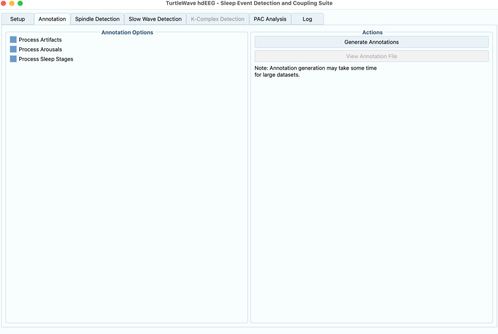
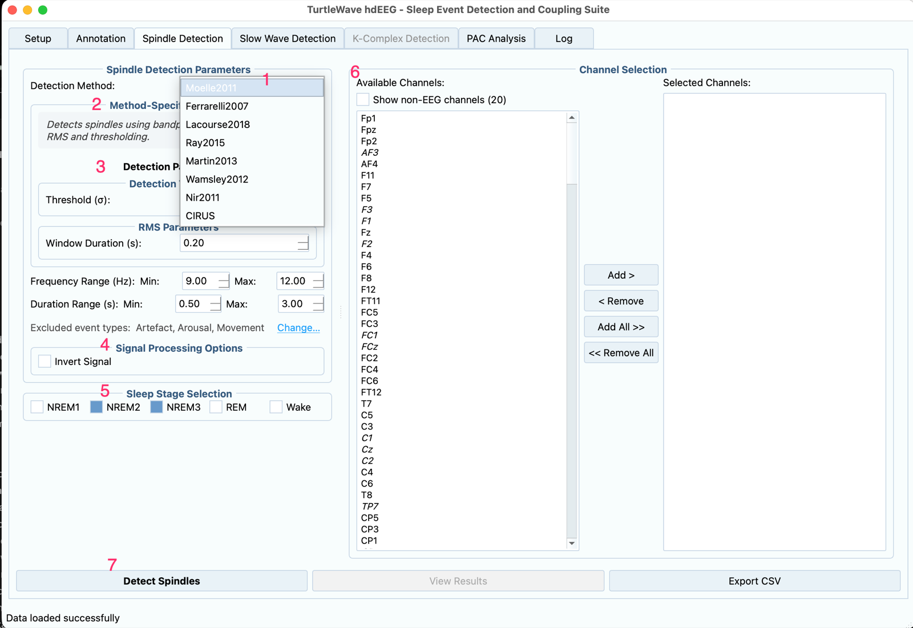
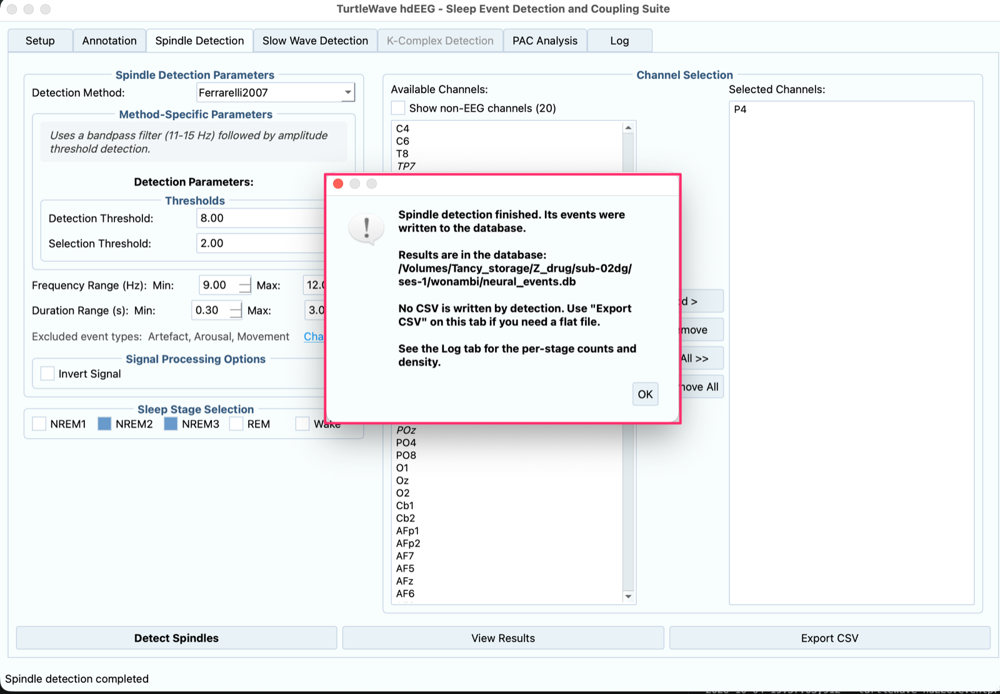
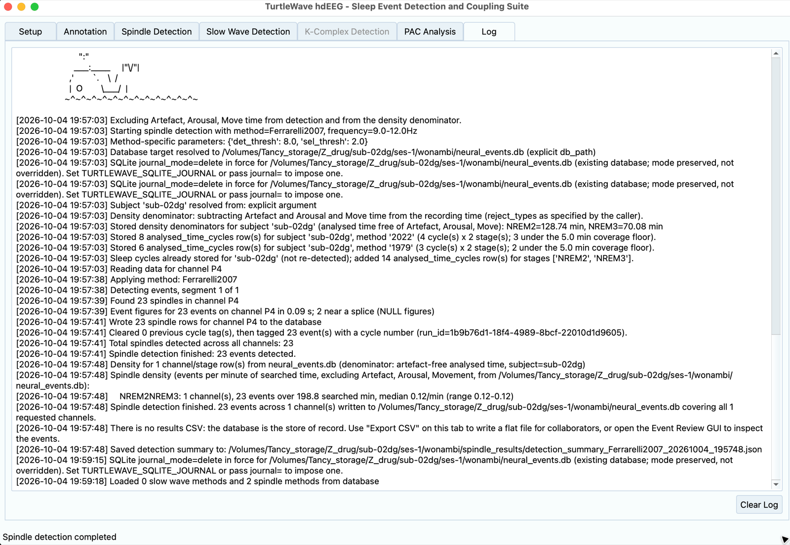

# Getting Started with TurtleWave hdEEG

Welcome! In the next 15 minutes, you'll go from zero to detecting sleep events in real EEG data. By the end of this tutorial, you'll understand the complete TurtleWave workflow and have working results you can build on.

!!! tip "First time with sleep EEG analysis?"
    Perfect! This tutorial assumes no prior experience. We'll explain everything as we go, and you'll learn by doing rather than reading theory.

## What You'll Accomplish

By following this tutorial, you will:

1. Launch the TurtleWave GUI and understand its interface
2. Load a sleep EEG recording
3. Generate automated sleep annotations
4. Detect sleep spindles in your data
5. Understand and locate your results

**Time needed:** 15 minutes  
**Prerequisites:** TurtleWave installed ([installation guide](../how-to/installation.md))

Let's dive in!

## Step 1: Launch the TurtleWave GUI

Open your terminal and type:

```bash
turtlewave_gui
```

The TurtleWave window should appear within a few seconds.

!!! success "GUI launched successfully?"
    Great! You should see the main interface with these tabs: Setup, Annotation, Spindle Detection, Slow Wave Detection, K-Complex Detection, PAC Analysis and Log.

!!! warning "GUI didn't launch?"
    If nothing happens, verify your installation:
    ```bash
    python -c "import turtlewave_hdEEG; print('Installation OK')"
    ```
    If this fails, revisit the [installation guide](../how-to/installation.md).

### Understanding the Interface

Take a moment to familiarize yourself with the layout:

- **Setup tab** - Data Selection (EEG file, output directory, annotation file), excluded event types and dataset information
- **Other tabs** - Annotation, the detection tabs (Spindle, Slow Wave, K-Complex, PAC Analysis) and the Log
- **Status line** - Messages at the bottom of the window


*The Setup tab after a recording has been loaded.*

The numbered markers in the screenshot are:

1. **EEG Data File**: the recording to analyse. **Browse...** opens a file picker.
2. **Output Directory**: the folder where results are written.
3. **Annotation File (Optional)**: an existing Wonambi XML file with sleep stages.
   Leave it empty if you are going to generate one in Step 3.
4. **Excluded event types**: time marked with a ticked type (here Artefact,
   Arousal and Movement) is not searched for events and is left out of the
   density denominator. Respiratory and Snoring are unticked. **Restore
   defaults** returns to the standard selection.
5. **Dataset Information**: what the loader read from the file, including the
   recording start and end, signal duration, sampling rate, channel counts, the
   reference and the interpolated channels.
6. The status line at the bottom, which reads `Data loaded successfully` once
   **Load Data** has finished.

You'll spend most of your time in the Setup tab and the Annotation tab.

## Step 2: Load Your EEG Data

Now let's load some data to analyze.

### Select Your EEG File

1. On the **Setup** tab, click **Browse...** beside **EEG Data File**
2. Navigate to your EEG data file
3. Select a file with extension `.set`, `.edf` or `.bdf`
4. Click **Open**

The file path should now appear in the **EEG Data File** box.

!!! example "Don't have data handy?"
    No problem! TurtleWave includes test data in the `tests/` directory of your installation. Look for files like `synthetic_sleep_eeg.set` to practice with.

### Set Your Output Directory

Results need somewhere to go:

1. Click **Browse...** beside **Output Directory**
2. Choose a folder where you want results saved
3. Click **Choose** (or **Open**, depending on your system)

!!! tip "Organization tip"
    Create a dedicated `results/` folder for each subject or recording session. This keeps your analysis organized as your project grows.

If you already have an annotation file, select it with **Browse...** beside **Annotation File (Optional)**. Otherwise leave it empty and generate one in Step 3.

Finally, click **Load Data**. You should now see the paths in the three boxes, the **Dataset Information** panel (marker 5 in the screenshot above) and the message `Data loaded successfully`.

You're ready to process!

## Step 3: Generate Sleep Annotations

Before detecting events, we need to know which parts of the recording contain which sleep stages. This is what annotation does.

### Why Annotations Matter

Think of annotations as a map of your recording. Without them, TurtleWave would search for sleep spindles everywhere—including wake periods where they don't occur. Annotations make detection faster and more accurate.

### Run the Annotation

1. Open the **Annotation** tab
2. Review the **Annotation Options** (**Process Artifacts**, **Process Arousals** and **Process Sleep Stages** are ticked by default and work well for most cases)
3. Click **Generate Annotations**

The process will start, and you'll see progress updates in the status panel.



*The Annotation tab, with the three Annotation Options ticked.*

**Generate Annotations** starts the annotation. **View Annotation File**
stays greyed out until the file exists.

!!! note "What's happening behind the scenes"
    TurtleWave is analyzing your data to identify:

    - **Artifacts** - Signal issues that could interfere with detection,
      including a short window around every EEGLAB "boundary" marker (where a
      segment of data was cut and spliced back together)
    - **Arousals** - Brief awakenings that fragment sleep
    - **Sleep stages** - Wake, N1, N2, N3, and REM periods

    By default, detection skips time marked Artifact, Arousal, or Movement.
    See
    [Which events are rejected by default, and why](../explanation/overview.md#which-annotation-events-are-rejected-by-default)
    if you want to change that.

This typically takes 2-5 minutes depending on your recording length.

### Confirm Success

Wait for the message "Annotations have been generated successfully". The status line reads `Annotations generated successfully`.

!!! success "Annotation finished?"
    Excellent! You've completed the foundation step. The annotations are automatically saved in your output directory as an XML file.

## Step 4: Detect Sleep Spindles

Now for the exciting part—detecting actual sleep events!

### What Are Sleep Spindles?

Sleep spindles are brief bursts of brain activity (roughly 9-16 Hz, depending on the definition) that occur during sleep, particularly in stage N2. They're important markers of memory consolidation and sleep quality.

### Configure Detection

1. Switch to the **Spindle Detection** tab
2. Review the default parameters:
    - **Detection Method:** `Moelle2011`
    - **Frequency Range (Hz):** Min 9.00, Max 12.00
    - **Duration Range (s):** Min 0.50, Max 3.00 (the tab fills these from the selected method, so they change when you pick another method)
    - **Threshold (σ):** the method's own default
    - **Sleep Stage Selection:** the stages to search; tick NREM2 and NREM3 for this tutorial

For this tutorial, keep the defaults—they're optimized for typical sleep recordings.



*The Spindle Detection tab, with the Detection Method list open.*

1. **Detection Method**: the drop-down is open and lists `Moelle2011`,
   `Ferrarelli2007`, `Lacourse2018`, `Ray2015`, `Martin2013`, `Wamsley2012`,
   `Nir2011` and `CIRUS`.
2. **Method-Specific Parameters**: a one-line description of the selected
   method.
3. **Detection Parameters**: the threshold and **RMS Parameters** of the
   method, then **Frequency Range (Hz)**, **Duration Range (s)** and the
   **Excluded event types** line, which has a **Change...** link.
4. **Signal Processing Options**: the **Invert Signal** checkbox.
5. **Sleep Stage Selection**: the stages to search. Here NREM2 and NREM3 are
   ticked.
6. **Channel Selection**: move channels from **Available Channels** to
   **Selected Channels** with **Add >**, **< Remove**, **Add All >>** and
   **<< Remove All**. **Show non-EEG channels (20)** adds the other channels to
   the list. Channel names in italics are interpolated channels.
7. **Detect Spindles**: starts detection. **View Results** and **Export CSV**
   sit beside it.

!!! tip "About these parameters"
    The defaults work well for most adult sleep data. As you gain experience, you might adjust these based on your specific research questions or population characteristics.

### Run Detection

Select at least one channel (**Add >** or **Add All >>**), then click **Detect Spindles**

You'll see:

- Progress messages in the **Log** tab as each channel is processed
- A count of the spindles found in each channel
- The status line changes to `Spindle detection completed` at the end

!!! note "Processing time"
    For a typical overnight recording with 64 channels, expect 5-10 minutes. High-density arrays (128+ channels) take longer but use the same simple workflow.

### Watch the Progress

As detection runs, the status panel shows which channels are being processed. This is normal—TurtleWave analyzes each channel independently, then combines results.

When detection ends, a message box confirms it:



*The message box shown when spindle detection finishes (highlighted).*

The highlighted box says that the events were written to the database, gives the path of `neural_events.db`, and says that no CSV is written by detection. Use **Export CSV** on the tab if you need a flat file. It points you to the **Log** tab for the per-stage counts and density.



*The Log tab after a run.*

The Log lists, in order, the excluded event types, the method and its parameters, the database that was written, the analysed time per stage used as the density denominator, the number of spindles found per channel, and the final density line. **Clear Log** empties it.

!!! success "Detection complete?"
    Fantastic! You've just detected your first sleep spindles. Let's see what you found.

## Step 5: Review Your Results

Time to examine what you've accomplished!

### Check the Statistics

After detection completes, the **Log** tab reports:

- **Total spindles detected** - Across all selected channels
- **Spindle density per stage** - Events per minute of searched time
- **Channel-wise counts** - Which channels showed most activity

Take a moment to review these numbers. They tell the story of your data.

!!! example "Typical results"
    For an 8-hour sleep recording, you might see:
    
    - 800-1200 total spindles
    - Most in N2 sleep (60-70%)
    - Fewer in N3 (20-30%)
    - Minimal in REM or wake

### Locate Your Output Files

Navigate to your output directory. You'll find:

**`neural_events.db`** - SQLite database holding every detected spindle

- One row per event, in the `events` table (`event_type = 'spindle'`)
- Queryable with SQL, pandas (`pd.read_sql_query`), or R (`DBI`/`RSQLite`) —
  no CSV or per-channel file to open first
- The store the EEG Review GUI reads from

**`*_annotations.xml`** - Sleep stage annotations

- Compatible with standard sleep analysis tools
- Can be imported into other software

**Log files** - Processing details

- Useful for troubleshooting
- Documents parameters used

!!! tip "Next steps with your data"
    Query `neural_events.db` straight from Python or R — see
    [Read the database with pandas and R](../how-to/read-database-with-pandas-and-r.md)
    for query patterns, or how to pull a flat CSV back out if a downstream
    tool needs one.

## What You've Learned

Congratulations! You've completed your first TurtleWave analysis. Let's recap what you now know:

✅ How to launch TurtleWave and navigate its interface  
✅ How to load EEG data and set up your workspace  
✅ Why annotations are essential and how to generate them  
✅ How to detect sleep spindles with appropriate parameters  
✅ Where to find your results and what they contain

### Understanding the Workflow

The pattern you just learned applies to all TurtleWave analyses:

1. **Load data** - Select your recording
2. **Annotate** - Map sleep stages and artifacts
3. **Detect** - Run event detection; results land in `neural_events.db`
   directly, with no separate import step
4. **Review** - Triage detected events in the QC dashboard

This same workflow works for slow waves, phase-amplitude coupling, and other analyses.

## Where to Go From Here

Now that you understand the basics, you're ready to explore more:

### Immediate Next Steps

**Review what you just detected:**

- [Review EEG events in the QC dashboard](eeg-review-gui-tutorial.md) — now
  review those events: triage flagged channels and drill into epochs before
  you trust the counts
- [Read the database with pandas and R](../how-to/read-database-with-pandas-and-r.md)
  — query `neural_events.db` directly for statistics, or pull a CSV back out
  if a downstream tool needs one

**Try different event types:**

- [Detect slow waves](../how-to/detect-slow-waves.md) instead of spindles
- Explore phase-amplitude coupling analysis
- Compare results across different sleep stages

**Customize your analysis:**

- Adjust detection parameters for your specific needs
- Process multiple files in batch mode
- Export results in different formats

### Deepen Your Knowledge

**Learn the Python API:**

Everything you just did in the GUI can be scripted for reproducibility and batch processing. Check the [API reference](../reference/api/index.md) to see how.

**Understand the algorithms:**

Read the [explanation section](../explanation/overview.md) to learn about the detection algorithms and why they work.

**Solve specific problems:**

Browse the [how-to guides](../how-to/installation.md) for solutions to common tasks and challenges.

## Troubleshooting

Ran into issues? Here are solutions to common problems:

### No Spindles Detected

**Possible causes:**

- Annotations didn't complete successfully
- Data doesn't contain sleep stages (check if it's actually sleep data)
- Detection threshold too strict

**Solutions:**

- Verify annotation completed without errors
- Check that your data includes sleep periods
- Try lowering the detection threshold slightly

### GUI Freezes or Crashes

**Possible causes:**

- Insufficient memory for large files
- Corrupted data file
- Missing dependencies

**Solutions:**

- Close other applications to free memory
- Try a different data file to isolate the issue
- Reinstall TurtleWave: `pip install --upgrade --force-reinstall turtlewave_hdEEG`

### Can't Find Output Files

**Possible causes:**

- Wrong output directory selected
- Processing didn't complete
- File permissions issue

**Solutions:**

- Double-check the output directory path in the GUI
- Look for error messages in the status panel
- Ensure you have write permissions to the output directory

!!! question "Still stuck?"
    Don't hesitate to ask for help! Open an issue on [GitHub Issues](https://github.com/TancyKao/TurtleWave-hdEEG/issues) with your error message and system details.

## Final Thoughts

You've taken your first steps into sleep EEG analysis with TurtleWave. What felt complex 15 minutes ago is now familiar. This is just the beginning—each analysis you run will deepen your understanding and reveal new insights in your data.

!!! success "You did it!"
    You've successfully completed the Getting Started tutorial. You now have the foundation to explore TurtleWave's full capabilities. Welcome to the community!

**Ready for more?** Pick your next adventure:

- [Review your detected events in the QC dashboard](eeg-review-gui-tutorial.md)
- [How to optimize spindle detection parameters](../how-to/detect-spindles.md#optimizing-detection)
- [Understanding TurtleWave's architecture](../explanation/overview.md)
- [API reference for scripting](../reference/api/index.md)

Happy analyzing!